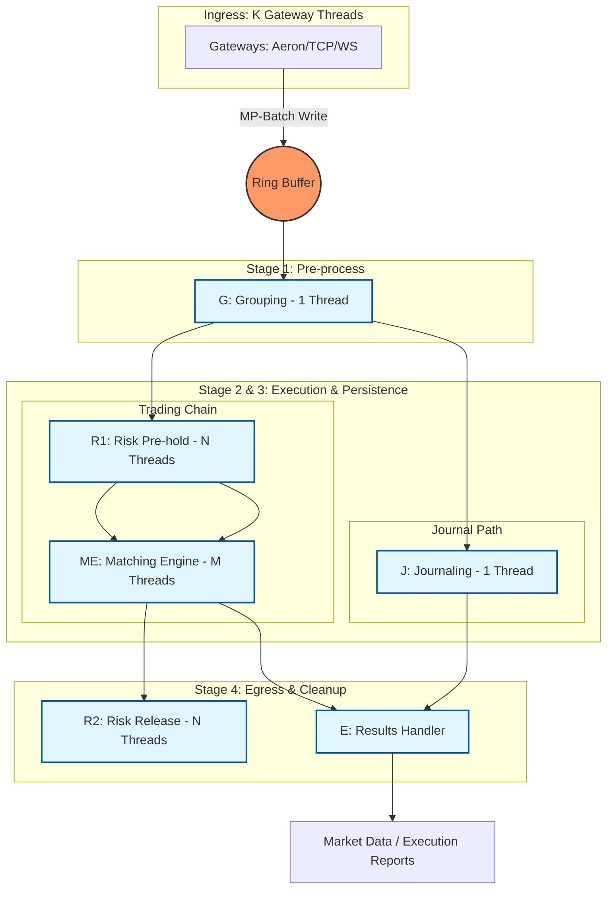

# Exchange-CPP

A high-performance, low-latency cryptocurrency exchange matching engine written in C++, 1:1 ported from [exchange-core](https://github.com/exchange-core/exchange-core).

**Key Performance**: P50: 0.50µs, P99: 0.73µs @ 1M TPS | Up to 9M TPS | P99 latency 2.5x-6.4x better than Java

## Performance

### Comparison with Java Implementation

Our test configuration matches the original Java `exchange-core` reference implementation:
- Single symbol (Margin mode)
- ~1K active users (2K currency accounts)
- 1K pending limit orders
- 3M benchmark commands
- Ring buffer size: 2,048
- Messages in group limit: 256

**Key Performance Highlights**:

| Metric | C++ | Java | Winner |
|--------|-----|------|--------|
| **Max Stable TPS** | 9M TPS | 6M TPS | ✅ C++ (1.50x) |
| **P50 @ 1M TPS** | 0.50µs | 0.51µs | ✅ C++ (1.02x) |
| **P99 @ 1M TPS** | 0.73µs | 4.7µs | ✅ C++ (6.4x) |
| **P50 @ 4M TPS** | 0.82µs | 0.6µs | ✅ Java (1.37x) |
| **P99 @ 4M TPS** | 1.6µs | 8.0µs | ✅ C++ (5.0x) |
| **P50 @ 6M TPS** | 1.25µs | 1.37µs | ✅ C++ (1.10x) |
| **P99 @ 6M TPS** | 4.6µs | 11.5µs | ✅ C++ (2.50x) |
| **P50 @ 8M TPS** | 3.8µs | N/A | ✅ C++ |
| **P99 @ 8M TPS** | 15.2µs | N/A | ✅ C++ |

**Summary**: C++ shows dramatically better P99 latency (tail latency) across all TPS rates, with improvements of 2.5-6.4x. After optimizing `orderIdIndex_` from ART to `ankerl::unordered_dense::map` (2026-01-16), C++ now achieves better P50 at 6M TPS and maintains stable performance up to 9M TPS. Maximum stable throughput improved from 8M to 9M TPS.

For detailed performance data, see [PERFORMANCE_BENCHMARK_COMPARISON.md](docs/PERFORMANCE_BENCHMARK_COMPARISON.md) and [LOW_LATENCY_CORE.md](docs/LOW_LATENCY_CORE.md).

## Features

- **Ultra-fast matching engine**: Lock-free, high-throughput order matching
- **Low latency**: Optimized for HFT (High-Frequency Trading) scenarios
- **Order book management**: Efficient order book data structures
- **Risk management**: Margin checks, position limits, and risk controls
- **Multi-currency support**: Support for multiple trading pairs
- **Event-driven architecture**: Based on disruptor-cpp ring buffer

## Technology Stack

- **C++26**: Latest C++ standard for cutting-edge performance and features
- **disruptor-cpp**: High-performance inter-thread communication ([SkynetNext/disruptor-cpp](https://github.com/SkynetNext/disruptor-cpp.git))
- **CMake**: Build system
- **Google Test**: Unit testing framework
- **Google Benchmark**: Performance benchmarking

## Project Status

✅ **Core Features Complete** - Matching engine, risk management, and performance optimizations are implemented and tested. See [PERFORMANCE_BENCHMARK_COMPARISON.md](docs/PERFORMANCE_BENCHMARK_COMPARISON.md) for benchmark results.

## System Architecture

The exchange core follows a multi-stage asynchronous pipeline. Functional blocks are pinned to specific CPU cores, communicating via lock-free sequence barriers.



### Thread Model & Functional Breakdown

| Role | Threads | Sharding | Responsibility |
| :--- | :--- | :--- | :--- |
| **Gateway** | **K** | `ConnID` | **Producer (MP-Batch)**: Protocol parsing, authentication, and batch publishing into Ring Buffer. |
| **Grouping (G)** | **1** | N/A | **Consumer**: Batching small orders and identifying cancel-replace patterns. |
| **Journaling (J)** | **1** | N/A | **Consumer (Parallel Path)**: Binary persistence for state recovery (FileChannel.write). |
| **Risk (R1)** | **N** | `UID` | **Consumer (Serial Path)**: Pre-match balance checks and speculative freezing. |
| **Matching (ME)** | **M** | `SymbolID` | **Consumer (Serial Path)**: OrderBook matching (Price-Time Priority). |
| **Risk (R2)** | **N** | `UID` | **Consumer (Parallel Cleanup)**: Final settlement, fee deduction, and profit/loss release. |
| **Results (E)** | **1** | N/A | **Consumer (Parallel Egress)**: Merging ME and J results into output stream (waits for ME + J). |

### Architectural Pillars
1.  **Lock-Free Pipeline**: Using `disruptor-cpp` to manage dependencies between stages without mutexes.
2.  **Thread Affinity**: Each core thread is pinned to a specific CPU physical core to maximize L1/L2 cache hits.
3.  **Stateful Sharding**: 
    *   **Risk Engine (N)**: Sharded by User ID to ensure account-level consistency.
    *   **Matching Engine (M)**: Sharded by Symbol ID to ensure order book-level consistency.
4.  **Deterministic Execution**: Every thread acts as a pure state machine; same input sequence always produces identical memory state.
5.  **Zero-Copy Memory**: `OrderCommand` is pre-allocated in the Ring Buffer; only logic ownership is transferred between stages.

## Building

### Prerequisites

- **CMake** 3.30 or higher (required for C++26 support)
- **C++26** compatible compiler:
  - **GCC 14+** (recommended) or **Clang 19+**
  - MSVC 19.40+ (Windows)
- **Git** (for submodules)

#### Installing GCC 14 on Ubuntu 22.04

If your system doesn't have GCC 14+, you can install it from source:

```bash
sudo apt install build-essential
sudo apt install libmpfr-dev libgmp3-dev libmpc-dev -y
wget http://ftp.gnu.org/gnu/gcc/gcc-14.1.0/gcc-14.1.0.tar.gz
tar -xf gcc-14.1.0.tar.gz
cd gcc-14.1.0
./configure -v --build=$(uname -m)-linux-gnu --host=$(uname -m)-linux-gnu --target=$(uname -m)-linux-gnu --prefix=/usr/local/gcc-14.1.0 --enable-checking=release --enable-languages=c,c++ --disable-multilib --program-suffix=-14.1.0
make -j$(nproc)
sudo make install

# Set as default using update-alternatives
sudo update-alternatives --install /usr/bin/gcc gcc /usr/local/gcc-14.1.0/bin/gcc-14.1.0 100
sudo update-alternatives --install /usr/bin/g++ g++ /usr/local/gcc-14.1.0/bin/g++-14.1.0 100
sudo update-alternatives --set gcc /usr/local/gcc-14.1.0/bin/gcc-14.1.0
sudo update-alternatives --set g++ /usr/local/gcc-14.1.0/bin/g++-14.1.0

# Add GCC 14 libstdc++ to library path (required for running programs)
echo 'export LD_LIBRARY_PATH=/usr/local/gcc-14.1.0/lib64:$LD_LIBRARY_PATH' >> ~/.bashrc
source ~/.bashrc

# Verify installation
gcc --version
g++ --version
```

**Note**: For Ubuntu 24.04+, GCC 14 is available via package manager:
```bash
sudo apt install gcc-14 g++-14
sudo update-alternatives --install /usr/bin/gcc gcc /usr/bin/gcc-14 100
sudo update-alternatives --install /usr/bin/g++ g++ /usr/bin/g++-14 100
```

### Build Steps

```bash
# Clone with submodules (recommended)
git clone --recursive <repository-url>
cd exchange-cpp

# If you already cloned without --recursive, initialize submodules:
git submodule update --init --recursive

# Build
mkdir build && cd build
cmake .. -DCMAKE_BUILD_TYPE=Release
cmake --build . -j$(nproc)

# Optional: Run tests (requires Google Test)
cmake .. -DBUILD_TESTING=ON
cmake --build . -j$(nproc)
ctest --output-on-failure

# Optional: Build benchmarks (requires Google Benchmark)
cmake .. -DBUILD_BENCHMARKS=ON
cmake --build . -j$(nproc)
```

### Third-Party Dependencies

The project uses the following submodules:

- **`reference/exchange-core`**: Original Java implementation for reference
- **`third_party/disruptor-cpp`**: [disruptor-cpp](https://github.com/SkynetNext/disruptor-cpp.git) - High-performance inter-thread communication library

Both are automatically initialized when cloning with `--recursive` or running `git submodule update --init --recursive`.

## System Optimization

For better performance, configure CPU isolation to reduce kernel scheduler overhead.

```bash
sudo nano /etc/default/grub
# Add to GRUB_CMDLINE_LINUX: isolcpus=8-15 nohz_full=8-15 rcu_nocbs=8-15
sudo update-grub
sudo reboot
```

**Verify:** `cat /sys/devices/system/cpu/isolated` should show `8-15`

**Note:** Reserve some CPUs (e.g., 0-7) for system use. Never isolate all CPUs.

## Testing & Benchmarks

```bash
cd build
ctest --output-on-failure  # Run all tests
./tests/perf/PerfLatency   # Run latency benchmarks
```

See [PERFORMANCE_BENCHMARK_COMPARISON.md](docs/PERFORMANCE_BENCHMARK_COMPARISON.md) for detailed results.

## References

- **Original Java Implementation**: [exchange-core](https://github.com/exchange-core/exchange-core)
- **Disruptor C++ Library**: [disruptor-cpp](https://github.com/SkynetNext/disruptor-cpp.git)
- **LMAX Disruptor**: [Official Documentation](https://lmax-exchange.github.io/disruptor/)

## License

Licensed under the Apache License, Version 2.0 (the "License");
you may not use this file except in compliance with the License.
You may obtain a copy of the License at

    http://www.apache.org/licenses/LICENSE-2.0

Unless required by applicable law or agreed to in writing, software
distributed under the License is distributed on an "AS IS" BASIS,
WITHOUT WARRANTIES OR CONDITIONS OF ANY KIND, either express or implied.
See the License for the specific language governing permissions and
limitations under the License.

This project is a C++ port of [exchange-core](https://github.com/exchange-core/exchange-core), which is also licensed under Apache License 2.0.

## Contributing

Contributions are welcome! Please see [PROJECT_STATUS.md](PROJECT_STATUS.md) for development roadmap and current status.

