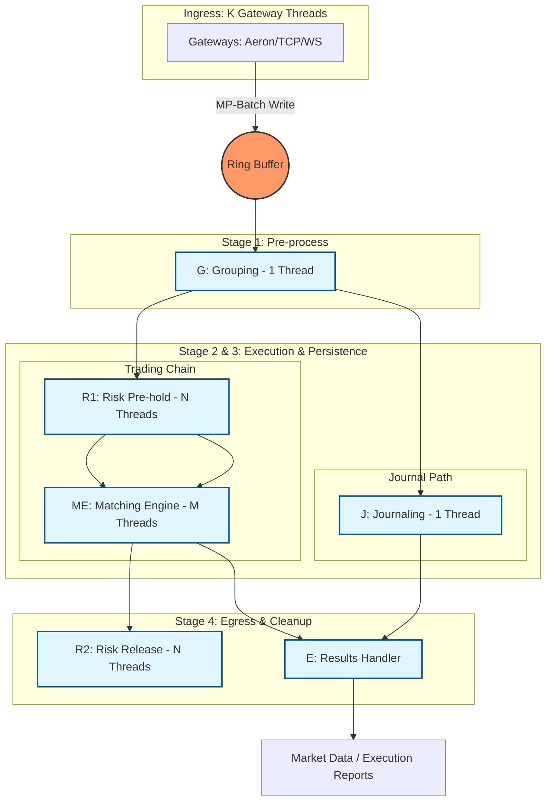

# Exchange-CPP

A high-performance, low-latency cryptocurrency exchange matching engine written in C++, 1:1 ported from [exchange-core](https://github.com/exchange-core/exchange-core).

## Performance

| Metric | C++ | Java | Improvement |
|--------|-----|------|-------------|
| **Max Stable TPS** | 9.4M | 6M | 1.57x |
| **P50 @ 1M TPS** | 0.49µs | 0.51µs | 1.04x |
| **P99 @ 1M TPS** | 0.72µs | 4.7µs | **6.5x** |
| **P99 @ 4M TPS** | 1.44µs | 8.0µs | **5.6x** |
| **P99 @ 6M TPS** | 3.2µs | 11.5µs | **3.6x** |

**Highlights**: P99 latency 3.6-6.5x better than Java | Stable up to 9.4M TPS | Exceeds Tier 1 exchange standards (CME, NASDAQ, ICE)

For detailed benchmarks, see [PERFORMANCE_BENCHMARK_COMPARISON.md](docs/PERFORMANCE_BENCHMARK_COMPARISON.md).

## Features

- **Ultra-fast matching engine**: Lock-free, high-throughput order matching
- **Low latency**: Optimized for HFT (High-Frequency Trading) scenarios
- **Order book management**: Efficient order book data structures
- **Risk management**: Margin checks, position limits, and risk controls
- **Multi-currency support**: Support for multiple trading pairs
- **Event-driven architecture**: Based on disruptor-cpp ring buffer

## Technology Stack

- **C++26**: Latest C++ standard for cutting-edge performance and features
- **disruptor-cpp**: High-performance inter-thread communication ([SkynetNext/disruptor-cpp](https://github.com/SkynetNext/disruptor-cpp.git))
- **CMake**: Build system
- **Google Test**: Unit testing framework
- **Google Benchmark**: Performance benchmarking

## Project Status

✅ **Core Features Complete** - Matching engine, risk management, and performance optimizations are implemented and tested. See [PERFORMANCE_BENCHMARK_COMPARISON.md](docs/PERFORMANCE_BENCHMARK_COMPARISON.md) for benchmark results.

## System Architecture

The exchange core follows a multi-stage asynchronous pipeline. Functional blocks are pinned to specific CPU cores, communicating via lock-free sequence barriers.



### Thread Model & Functional Breakdown

| Role | Threads | Sharding | Responsibility |
| :--- | :--- | :--- | :--- |
| **Gateway** | **K** | `ConnID` | **Producer (MP-Batch)**: Protocol parsing, authentication, and batch publishing into Ring Buffer. |
| **Grouping (G)** | **1** | N/A | **Consumer**: Batching small orders and identifying cancel-replace patterns. |
| **Journaling (J)** | **1** | N/A | **Consumer (Parallel Path)**: Binary persistence for state recovery (FileChannel.write). |
| **Risk (R1)** | **N** | `UID` | **Consumer (Serial Path)**: Pre-match balance checks and speculative freezing. |
| **Matching (ME)** | **M** | `SymbolID` | **Consumer (Serial Path)**: OrderBook matching (Price-Time Priority). |
| **Risk (R2)** | **N** | `UID` | **Consumer (Parallel Cleanup)**: Final settlement, fee deduction, and profit/loss release. |
| **Results (E)** | **1** | N/A | **Consumer (Parallel Egress)**: Merging ME and J results into output stream (waits for ME + J). |

### Architectural Pillars
1.  **Lock-Free Pipeline**: Using `disruptor-cpp` to manage dependencies between stages without mutexes.
2.  **Thread Affinity**: Each core thread is pinned to a specific CPU physical core to maximize L1/L2 cache hits.
3.  **Stateful Sharding**: 
    *   **Risk Engine (N)**: Sharded by User ID to ensure account-level consistency.
    *   **Matching Engine (M)**: Sharded by Symbol ID to ensure order book-level consistency.
4.  **Deterministic Execution**: Every thread acts as a pure state machine; same input sequence always produces identical memory state.
5.  **Zero-Copy Memory**: `OrderCommand` is pre-allocated in the Ring Buffer; only logic ownership is transferred between stages.

## Building

```bash
git clone --recursive <repository-url>
cd exchange-cpp
mkdir build && cd build
cmake .. -DCMAKE_BUILD_TYPE=Release
cmake --build . -j$(nproc)
```

**Requirements**: CMake 3.30+, GCC 14+ / Clang 19+ / MSVC 19.40+

For detailed build instructions, GCC installation, and system optimization, see [BUILD.md](docs/BUILD.md).

## References

- **Original Java Implementation**: [exchange-core](https://github.com/exchange-core/exchange-core)
- **Disruptor C++ Library**: [disruptor-cpp](https://github.com/SkynetNext/disruptor-cpp.git)
- **LMAX Disruptor**: [Official Documentation](https://lmax-exchange.github.io/disruptor/)

## License

Licensed under the Apache License, Version 2.0 (the "License");
you may not use this file except in compliance with the License.
You may obtain a copy of the License at

    http://www.apache.org/licenses/LICENSE-2.0

Unless required by applicable law or agreed to in writing, software
distributed under the License is distributed on an "AS IS" BASIS,
WITHOUT WARRANTIES OR CONDITIONS OF ANY KIND, either express or implied.
See the License for the specific language governing permissions and
limitations under the License.

This project is a C++ port of [exchange-core](https://github.com/exchange-core/exchange-core), which is also licensed under Apache License 2.0.

## Contributing

Contributions are welcome! Please see [PROJECT_STATUS.md](PROJECT_STATUS.md) for development roadmap and current status.

