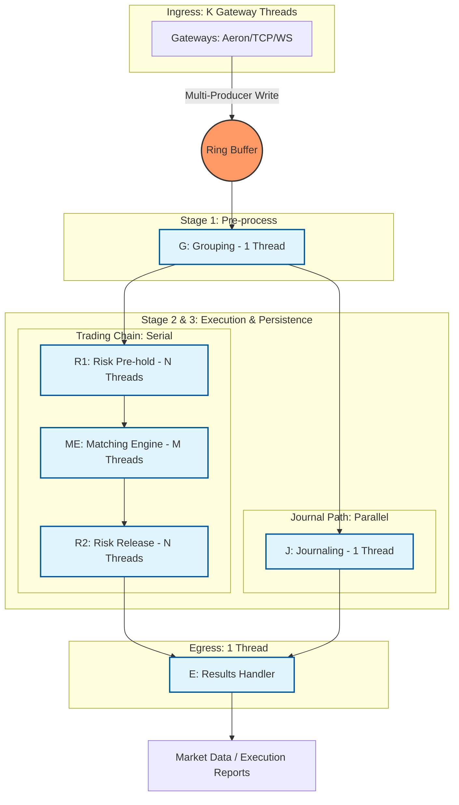

# Exchange-CPP

A high-performance, low-latency cryptocurrency exchange matching engine written in C++, 1:1 ported from [exchange-core](https://github.com/exchange-core/exchange-core).

## Overview

This project is a complete C++ rewrite of the Java-based exchange-core matching engine, utilizing [disruptor-cpp](https://github.com/SkynetNext/disruptor-cpp.git) for ultra-fast inter-thread communication, inspired by LMAX Disruptor.

## Features

- **Ultra-fast matching engine**: Lock-free, high-throughput order matching
- **Low latency**: Optimized for HFT (High-Frequency Trading) scenarios
- **Order book management**: Efficient order book data structures
- **Risk management**: Margin checks, position limits, and risk controls
- **Multi-currency support**: Support for multiple trading pairs
- **Event-driven architecture**: Based on disruptor-cpp ring buffer

## Technology Stack

- **C++17+**: Modern C++ features for performance and safety
- **disruptor-cpp**: High-performance inter-thread communication ([SkynetNext/disruptor-cpp](https://github.com/SkynetNext/disruptor-cpp.git))
- **CMake**: Build system
- **Google Test**: Unit testing framework
- **Google Benchmark**: Performance benchmarking

## Project Status

🚧 **In Development** - Initial planning and architecture phase

## System Architecture

The exchange core follows a multi-stage asynchronous pipeline. Functional blocks are pinned to specific CPU cores, communicating via lock-free sequence barriers.



### Thread Model & Functional Breakdown

| Role | Threads | Sharding | Responsibility |
| :--- | :--- | :--- | :--- |
| **Gateway** | **K** | `ConnID` | Protocol parsing, authentication, and publishing into Ring Buffer. |
| **Grouping (G)** | **1** | N/A | Batching small orders and identifying cancel-replace patterns. |
| **Journaling (J)** | **1** | N/A | **Parallel Path**: Binary persistence for state recovery (mmap). |
| **Risk (R1)** | **N** | `UID` | **Serial Path**: Pre-match balance checks and speculative freezing. |
| **Matching (ME)** | **M** | `SymbolID` | **Serial Path**: OrderBook matching (Price-Time Priority). |
| **Risk (R2)** | **N** | `UID` | **Serial Path**: Final settlement, fee deduction, and profit/loss release. |
| **Results (E)** | **1** | N/A | Merging parallel events into a single output stream. |

### Architectural Pillars
1.  **Lock-Free Pipeline**: Using `disruptor-cpp` to manage dependencies between stages without mutexes.
2.  **Thread Affinity**: Each core thread is pinned to a specific CPU physical core to maximize L1/L2 cache hits.
3.  **Stateful Sharding**: 
    *   **Risk Engine (N)**: Sharded by User ID to ensure account-level consistency.
    *   **Matching Engine (M)**: Sharded by Symbol ID to ensure order book-level consistency.
4.  **Deterministic Execution**: Every thread acts as a pure state machine; same input sequence always produces identical memory state.
5.  **Zero-Copy Memory**: `OrderCommand` is pre-allocated in the Ring Buffer; only logic ownership is transferred between stages.

## Project Structure

The directory structure is **1:1 mapped** to the Java `exchange-core` for easy reference during porting:

```
exchange-cpp/
├── CMakeLists.txt          # Main CMake configuration
├── README.md               # This file
├── PLAN.md                 # Development plan
├── reference/              # Reference implementations
│   └── exchange-core/      # Original Java implementation (git submodule)
│       └── src/main/java/exchange/core2/core/
│           ├── common/     # → include/exchange/core/common/
│           ├── orderbook/  # → include/exchange/core/orderbook/
│           ├── processors/ # → include/exchange/core/processors/
│           └── utils/      # → include/exchange/core/utils/
├── third_party/            # Third-party dependencies
│   └── disruptor-cpp/      # Git submodule
├── include/                # Public headers (simplified from Java package structure)
│   └── exchange/
│       └── core/
│           ├── common/         # Common data models (Order, Trade, etc.)
│           │   ├── api/        # API command definitions
│           │   ├── cmd/        # OrderCommand, CommandResultCode
│           │   └── config/     # Configuration classes
│           ├── orderbook/      # OrderBook implementations
│           ├── processors/     # Pipeline processors (G, R1, ME, R2, J, E)
│           └── utils/          # Utility functions
├── src/                    # Implementation files (mirrors include/)
│   └── exchange/
│       └── core/
├── tests/                  # Unit tests
├── benchmarks/             # Performance benchmarks
├── examples/               # Usage examples
└── docs/                   # Documentation
```

## Building

### Prerequisites

- **CMake** 3.20 or higher
- **C++17** compatible compiler (GCC 7+, Clang 5+, MSVC 2017+)
- **Git** (for submodules)

### Build Steps

```bash
# Method 1: Clone with submodules (recommended)
git clone --recursive https://github.com/your-org/exchange-cpp.git
cd exchange-cpp

# Method 2: If you already cloned without --recursive, initialize submodules:
git clone https://github.com/your-org/exchange-cpp.git
cd exchange-cpp
git submodule update --init --recursive

# Build
mkdir build && cd build
cmake .. -DCMAKE_BUILD_TYPE=Release
cmake --build .

# Optional: Run tests (requires Google Test)
cmake .. -DBUILD_TESTING=ON
cmake --build .
ctest --output-on-failure

# Optional: Build benchmarks (requires Google Benchmark)
cmake .. -DBUILD_BENCHMARKS=ON
cmake --build .
```

### Third-Party Dependencies

The project uses the following submodules:

- **`reference/exchange-core`**: Original Java implementation for reference
- **`third_party/disruptor-cpp`**: [disruptor-cpp](https://github.com/SkynetNext/disruptor-cpp.git) - High-performance inter-thread communication library

Both are automatically initialized when cloning with `--recursive` or running `git submodule update --init --recursive`.

## Testing

```bash
cd build
ctest --output-on-failure
```

## Benchmarks

```bash
cd build
./benchmarks/exchange_cpp_benchmarks
```

## References

- **Original Java Implementation**: [exchange-core](https://github.com/exchange-core/exchange-core)
- **Disruptor C++ Library**: [disruptor-cpp](https://github.com/SkynetNext/disruptor-cpp.git)
- **LMAX Disruptor**: [Official Documentation](https://lmax-exchange.github.io/disruptor/)

## License

[To be determined - check original exchange-core license]

## Contributing

Contributions are welcome! Please see [PLAN.md](PLAN.md) for development roadmap.

