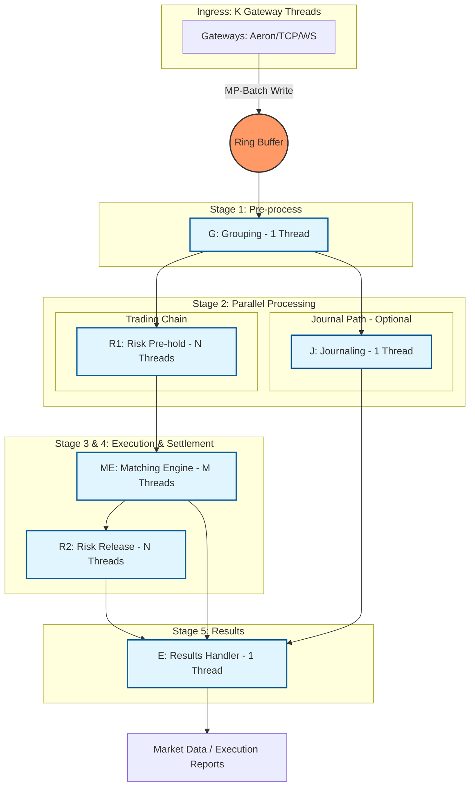

# Exchange-CPP Architecture

This document provides a detailed explanation of the Exchange-CPP architecture, focusing on the Ring Buffer, Disruptor pattern, Sequence dependencies, and the actual class composition.

## Table of Contents

1. [Overview](#overview)
2. [Ring Buffer Fundamentals](#ring-buffer-fundamentals)
3. [Disruptor Pattern](#disruptor-pattern)
4. [Sequence and Dependencies](#sequence-and-dependencies)
5. [Pipeline Architecture](#pipeline-architecture)
6. [Class Composition](#class-composition)
7. [Data Flow](#data-flow)

## Overview

Exchange-CPP uses a **lock-free, multi-stage asynchronous pipeline** based on the Disruptor pattern. All inter-thread communication happens through a single Ring Buffer, with dependencies managed via Sequence barriers.



## Ring Buffer Fundamentals

### What is a Ring Buffer?

A **Ring Buffer** (also called Circular Buffer) is a fixed-size array that wraps around when it reaches the end. In Exchange-CPP, it stores `OrderCommand` objects pre-allocated at startup.

```cpp
// Ring Buffer Type
using RingBufferT = disruptor::MultiProducerRingBuffer<
    common::cmd::OrderCommand,  // Event type
    WaitStrategyT               // Wait strategy (Blocking/Yielding/BusySpin)
>;

// Creation
const int ringBufferSize = 32768;  // Must be power of 2
auto eventFactory = std::make_shared<OrderCommandEventFactory>();
auto *waitStrategy = GetWaitStrategyInstance<WaitStrategyT>();

disruptor_ = std::make_unique<DisruptorT>(
    eventFactory, ringBufferSize, *threadFactory, *waitStrategy);
auto &ringBuffer = disruptor_->getRingBuffer();
```

### Key Properties

1. **Fixed Size**: Pre-allocated at startup (typically 32K slots)
2. **Power of 2**: Size must be power of 2 for efficient modulo operations
3. **Zero-Copy**: Events are pre-allocated, only references are passed
4. **Lock-Free**: Uses atomic operations and memory barriers
5. **Multi-Producer**: Multiple gateway threads can write concurrently

### Ring Buffer Operations

#### Producer (Gateway Threads)

```cpp
// 1. Claim a sequence (slot) in the ring buffer
int64_t seq = ringBuffer->next();

// 2. Get the event at that sequence
auto &event = ringBuffer->get(seq);

// 3. Write data into the event
event.orderId = 12345;
event.price = 10000;
event.size = 100;

// 4. Publish the event (makes it visible to consumers)
ringBuffer->publish(seq);
```

#### Consumer (Processor Threads)

```cpp
// 1. Wait for available sequence (via SequenceBarrier)
int64_t availableSeq = sequenceBarrier->waitFor(nextSequence);

// 2. Process events in batch
for (int64_t seq = nextSequence; seq <= availableSeq; seq++) {
    auto &event = ringBuffer->get(seq);
    eventHandler->OnEvent(seq, &event);
}

// 3. Update sequence (mark as processed)
sequence.set(availableSeq);
```

### Ring Buffer Wrap Prevention

The Ring Buffer must prevent **wrapping** (overwriting unprocessed events). This is achieved by:

1. **Gating Sequences**: Producers track the slowest consumer sequence
2. **Sequence Barriers**: Consumers wait for dependencies before processing
3. **Size Check**: `ringBuffer->next()` blocks if buffer would wrap

```cpp
// Producer checks: can I write at sequence N?
// Only if: N - slowestConsumerSequence < ringBufferSize
int64_t nextSeq = ringBuffer->next();  // May block here
```

## Disruptor Pattern

### Core Concepts

The **Disruptor** is a framework for coordinating work between threads using a Ring Buffer. It separates three concerns:

1. **Storage**: Ring Buffer (data structure)
2. **Coordination**: Sequence Barriers (dependency management)
3. **Processing**: Event Processors (business logic)

### Disruptor Components

```cpp
// Disruptor DSL (Domain-Specific Language)
using DisruptorT = disruptor::dsl::Disruptor<
    common::cmd::OrderCommand,           // Event type
    disruptor::dsl::ProducerType::MULTI, // Multi-producer
    WaitStrategyT                        // Wait strategy
>;

// Disruptor manages:
// - Ring Buffer creation
// - Event Processor registration
// - Dependency graph construction
// - Thread lifecycle
```

### Wait Strategies

Different wait strategies trade off latency vs CPU usage:

| Strategy | Latency | CPU Usage | Use Case |
|----------|---------|-----------|----------|
| **BusySpinWaitStrategy** | Lowest | Highest | Ultra-low latency, dedicated cores |
| **YieldingWaitStrategy** | Low | Medium | Balanced performance |
| **BlockingWaitStrategy** | Higher | Lowest | General purpose, predictable |

```cpp
// Wait strategy selection
auto *waitStrategy = GetWaitStrategyInstance<disruptor::BlockingWaitStrategy>();
```

## Sequence and Dependencies

### What is a Sequence?

A **Sequence** is an atomic counter that tracks progress through the Ring Buffer:

- **Producer Sequence**: Next slot to write (cursor)
- **Consumer Sequence**: Last slot processed

```cpp
class Sequence {
    std::atomic<int64_t> value_;
public:
    int64_t get() const;
    void set(int64_t value);
    // ...
};
```

### Sequence Barriers

A **SequenceBarrier** coordinates dependencies between consumers:

```cpp
// Create barrier that waits for dependencies
auto barrier = ringBuffer->newBarrier(
    barrierSequences,  // Array of dependency sequences
    count              // Number of dependencies
);

// Wait for available sequence
int64_t availableSeq = barrier->waitFor(nextSequence);
```

### Dependency Graph

The dependency graph ensures correct ordering:

```
Ring Buffer (Producer)
    ↓
Grouping (G) - Sequence G
    ├─→ Risk Pre-hold (R1) - Sequence R1 (depends on G)
    │       ↓
    │   Matching Engine (ME) - Sequence ME (depends on R1)
    │       ├─→ Risk Release (R2) - Sequence R2 (depends on ME)
    │       └─→ Results Handler (E) - Sequence E (depends on ME)
    │
    └─→ Journaling (J) - Sequence J (depends on G)
            ↓
        Results Handler (E) - Sequence E (depends on J)
```

**Key Points**:
- **E depends on both ME and J**: Must wait for both to complete
- **R2 depends on ME**: Can process in parallel with E
- **R1 depends on G**: Serial path (trading chain)
- **J depends on G**: Parallel path (journaling)

### Implementation Example

```cpp
// Stage 1: Grouping (depends on Ring Buffer)
auto groupingBarrier = ringBuffer->newBarrier(nullptr, 0);
auto groupingProcessor = createGroupingProcessor(ringBuffer, groupingBarrier);

// Stage 2: Risk Pre-hold (depends on Grouping)
disruptor::Sequence *groupingSeq = &groupingProcessor->getSequence();
auto r1Barrier = ringBuffer->newBarrier(&groupingSeq, 1);
auto r1Processor = createRiskProcessor(ringBuffer, r1Barrier);

// Stage 3: Matching Engine (depends on Risk Pre-hold)
// Note: ME uses simple EventHandler, not Two-Step Processor
disruptor::Sequence *r1Seq = &r1Processor->getSequence();
auto meBarrier = ringBuffer->newBarrier(&r1Seq, 1);
auto meHandler = createMatchingEngineHandler(ringBuffer, meBarrier);

// Stage 4: Results Handler (depends on ME and Journaling)
disruptor::Sequence *meSeq = &meProcessor->getSequence();
disruptor::Sequence *journalSeq = &journalProcessor->getSequence();
disruptor::Sequence *dependencies[] = {meSeq, journalSeq};
auto resultsBarrier = ringBuffer->newBarrier(dependencies, 2);
auto resultsProcessor = createResultsProcessor(ringBuffer, resultsBarrier);
```

## Pipeline Architecture

### Stage 1: Grouping (G)

**Class**: `GroupingProcessor`  
**Threads**: 1  
**Dependencies**: Ring Buffer (producer)

**Responsibilities**:
- Batch small orders
- Identify cancel-replace patterns
- Pre-process commands
- **Set `eventsGroup`** for group-based processing (enables pipeline parallelism)

**Key Function: Group Creation**

GroupingProcessor assigns `eventsGroup` to each command, creating groups based on:
- **Message count**: Every N messages (configurable `msgsInGroupLimit_`), except for `PERSIST_STATE_RISK` commands
- **Time-based**: When no new messages arrive, checks if current time exceeds `groupLastNs` (last processing time + `maxGroupDurationNs`). If exceeded, creates a new group
- **Special commands**: `RESET`, `PERSIST_STATE_MATCHING`, `GROUPING_CONTROL` trigger new groups
- **Binary commands**: `BINARY_DATA_COMMAND` and `BINARY_DATA_QUERY` (when `symbol == -1`) also trigger new groups

```cpp
// Simplified version - actual implementation includes exception handling,
// WaitSpinningHelper, time-based checks, and event pooling
class GroupingProcessor {
    void ProcessEvents() {
        int64_t nextSequence = sequence_.get() + 1L;
        int64_t groupCounter = 0;
        int64_t msgsInGroup = 0;
        
        while (true) {
            int64_t availableSequence = waitSpinningHelper_->TryWaitFor(nextSequence);
            
            if (nextSequence <= availableSequence) {
                while (nextSequence <= availableSequence) {
                    cmd = &ringBuffer->get(nextSequence);
                    
                    // GROUPING_CONTROL command enables/disables grouping
                    if (cmd->command == GROUPING_CONTROL) {
                        groupingEnabled = (cmd->orderId == 1);
                        cmd->resultCode = CommandResultCode::SUCCESS;
                    }
                    
                    if (!groupingEnabled) {
                        cmd->matcherEvent = nullptr;
                        cmd->marketData = nullptr;
                        continue;
                    }
                    
                    // Special commands trigger new group
                    if (cmd->command == RESET || 
                        cmd->command == PERSIST_STATE_MATCHING ||
                        cmd->command == GROUPING_CONTROL) {
                        groupCounter++;
                        msgsInGroup = 0;
                    }
                    
                    // Binary commands (with symbol == -1) also trigger new group
                    if ((cmd->command == BINARY_DATA_COMMAND || 
                         cmd->command == BINARY_DATA_QUERY) && 
                        cmd->symbol == -1) {
                        groupCounter++;
                        msgsInGroup = 0;
                    }
                    
                    // Assign group ID
                    cmd->eventsGroup = groupCounter;
                    
                    // Switch group after N messages (except PERSIST_STATE_RISK)
                    if (msgsInGroup >= msgsInGroupLimit_ &&
                        cmd->command != PERSIST_STATE_RISK) {
                        groupCounter++;
                        msgsInGroup = 0;
                    }
                    
                    msgsInGroup++;
                    nextSequence++;
                }
                sequence_.set(availableSequence);
                // Update time threshold for next time-based check
                groupLastNs = now() + maxGroupDurationNs_;
            } else {
                // No new messages - check time-based grouping
                int64_t t = now();
                if (msgsInGroup > 0 && t > groupLastNs) {
                    groupCounter++;
                    msgsInGroup = 0;
                }
            }
        }
    }
};
```

**Purpose**: Groups enable pipeline parallelism in R1 - R1 can publish Sequence at group boundaries, allowing ME to start processing while R1 continues with the next group.

### Stage 2: Risk Pre-hold (R1)

**Class**: `TwoStepMasterProcessor` + `TwoStepSlaveProcessor`  
**Threads**: N (sharded by User ID)  
**Dependencies**: Grouping (G)

**Responsibilities**:
- Pre-match balance checks
- Speculative freezing of funds
- Risk validation

**Why Two-Step Processor?**

R1 uses the Two-Step Processor pattern to enable **pipeline parallelism** through group-based processing:

1. **Events are grouped by `eventsGroup`** (set by GroupingProcessor):
   - Groups are created every N messages (configurable `msgsInGroupLimit_`)
   - Special commands (`RESET`, `PERSIST_STATE_MATCHING`, `GROUPING_CONTROL`) trigger new groups
   - Binary commands (`BINARY_DATA_COMMAND`, `BINARY_DATA_QUERY` with `symbol == -1`) trigger new groups
   - Time-based grouping: when no new messages arrive, checks if time exceeds threshold

2. **Master detects group boundaries**:
   ```cpp
   if (cmd->eventsGroup != currentSequenceGroup) {
       // New group detected - trigger slave to process previous group
       PublishProgressAndTriggerSlaveProcessor(nextSequence);
       currentSequenceGroup = cmd->eventsGroup;
   }
   ```

3. **Pipeline parallelism benefit**:
   - **Master** processes events and detects group boundaries
   - When a group is complete, Master **publishes Sequence** immediately
   - **ME (Matching Engine)** can start processing the completed group while R1 is still processing the next group
   - This enables **overlapping execution**: R1 and ME work on different groups simultaneously

```cpp
// Two-step processor pattern (simplified - actual includes exception handling,
// WaitSpinningHelper, forcedPublish mechanism, and SHUTDOWN_SIGNAL handling)
// Master: Reads from ring buffer, detects group boundaries, coordinates
// Slave: Processes events within a group, updates sequence

class TwoStepMasterProcessor {
    void ProcessEvents() {
        int64_t nextSequence = sequence_.get() + 1L;
        int64_t currentSequenceGroup = 0;
        
        // Wait until slave processor is ready
        while (slaveProcessor_ != nullptr && !slaveProcessor_->isRunning()) {
            std::this_thread::yield();
        }
        
        while (true) {
            // Use WaitSpinningHelper for optimized waiting
            int64_t availableSequence = waitSpinningHelper_->TryWaitFor(nextSequence);
            
            if (nextSequence <= availableSequence) {
                while (nextSequence <= availableSequence) {
                    cmd = &ringBuffer->get(nextSequence);
                    
                    // Detect group boundary
                    if (cmd->eventsGroup != currentSequenceGroup) {
                        // Publish progress for previous group
                        // This allows ME to start processing while R1 continues
                        PublishProgressAndTriggerSlaveProcessor(nextSequence);
                        currentSequenceGroup = cmd->eventsGroup;
                    }
                    
                    // Process event - may return forcedPublish flag
                    bool forcedPublish = false;
                    try {
                        forcedPublish = eventHandler_->OnEvent(nextSequence, cmd);
                    } catch (const std::exception &ex) {
                        // Exception handling...
                        throw;
                    }
                    
                    nextSequence++;
                    
                    // If forcedPublish is true, immediately publish sequence
                    if (forcedPublish) {
                        sequence_.set(nextSequence - 1);
                        waitSpinningHelper_->SignalAllWhenBlocking();
                    }
                    
                    // Handle shutdown signal
                    if (cmd->command == SHUTDOWN_SIGNAL) {
                        PublishProgressAndTriggerSlaveProcessor(nextSequence);
                    }
                }
                sequence_.set(availableSequence);
                waitSpinningHelper_->SignalAllWhenBlocking();
            }
        }
    }
    
    void PublishProgressAndTriggerSlaveProcessor(int64_t nextSequence) {
        sequence_.set(nextSequence - 1);
        waitSpinningHelper_->SignalAllWhenBlocking();
        if (slaveProcessor_ != nullptr) {
            slaveProcessor_->HandlingCycle(nextSequence);
        }
    }
};
```

**Without Two-Step**: ME would have to wait for R1 to process ALL events before starting, reducing parallelism.

### Stage 3: Matching Engine (ME)

**Class**: `EventHandler` + `MatchingEngineRouter`  
**Threads**: M (sharded by Symbol ID)  
**Dependencies**: Risk Pre-hold (R1)

**Responsibilities**:
- Order book matching (Price-Time Priority)
- Trade execution
- Order book updates

**Note**: Matching Engine uses a simple `EventHandler` pattern, not the Two-Step Processor pattern. Sharding is handled internally by routing to different `OrderBook` instances based on Symbol ID using `SymbolForThisHandler()` method.

**Sharding Logic**: Each `MatchingEngineRouter` instance handles a subset of symbols. The routing is done by checking if `SymbolForThisHandler(symbolId)` returns true for the current handler instance.

```cpp
// MatchingEngineEventHandler wraps MatchingEngineRouter
class MatchingEngineEventHandler : public EventHandler<OrderCommand> {
public:
    MatchingEngineEventHandler(MatchingEngineRouter *matchingEngine)
        : matchingEngine_(matchingEngine) {}
    
    void onEvent(OrderCommand &cmd, int64_t sequence, bool endOfBatch) override {
        matchingEngine_->ProcessOrder(sequence, &cmd);
    }

private:
    MatchingEngineRouter *matchingEngine_;
};

// MatchingEngineRouter routes to appropriate OrderBook
class MatchingEngineRouter {
    void ProcessOrder(int64_t seq, OrderCommand *cmd) {
        const auto command = cmd->command;
        
        // Handle matching commands (PLACE_ORDER, CANCEL_ORDER, etc.)
        if (command == MOVE_ORDER || command == CANCEL_ORDER || 
            command == PLACE_ORDER || command == REDUCE_ORDER ||
            command == ORDER_BOOK_REQUEST) {
            // Route to appropriate OrderBook by SymbolID
            // Only process if this handler is responsible for this symbol
            if (SymbolForThisHandler(cmd->symbol)) {
                ProcessMatchingCommand(cmd);
            }
            return;
        }
        
        // Handle other commands (RESET, BINARY_DATA, etc.)
        // ...
    }
    
    bool SymbolForThisHandler(int32_t symbol) {
        // Sharding logic: each handler processes symbols where
        // symbol % numHandlers == shardId
        return (symbol % numHandlers_) == shardId_;
    }
};
```

### Stage 2 (Parallel): Journaling (J)

**Class**: `JournalingEventHandler` (wraps `ISerializationProcessor`)  
**Threads**: 1  
**Dependencies**: Grouping (G)  
**Optional**: Only enabled when `serializationCfg.enableJournaling == true`

**Responsibilities**:
- Binary persistence for state recovery
- Write commands to disk via `ISerializationProcessor::WriteToJournal`
- Snapshot creation and management
- Journal replay for state recovery

**Note**: Journaling is an independent `EventHandler`, not a variant of `GroupingProcessor`. It runs in parallel with the trading chain (R1 → ME), both depending on Grouping (G).

```cpp
// JournalingEventHandler wraps ISerializationProcessor
class JournalingEventHandler : public EventHandler<OrderCommand> {
public:
    explicit JournalingEventHandler(
        ISerializationProcessor *processor) : processor_(processor) {}
    
    void onEvent(OrderCommand &cmd, int64_t sequence, bool endOfBatch) override {
        // Delegate to serialization processor
        processor_->WriteToJournal(&cmd, sequence, endOfBatch);
    }

private:
    ISerializationProcessor *processor_;
};

// ISerializationProcessor implementations:
// - DummySerializationProcessor: No-op (for testing)
// - DiskSerializationProcessor: Writes to disk with LZ4 compression
```

### Stage 5: Risk Release (R2)

**Class**: `TwoStepSlaveProcessor`  
**Threads**: N (sharded by User ID)  
**Dependencies**: Matching Engine (ME)

**Responsibilities**:
- Final settlement
- Fee deduction
- Profit/loss release
- Balance updates

**Note**: R2 uses only `TwoStepSlaveProcessor` (no Master). It processes events after ME completes, triggered by the Master-Slave link from R1.

### Stage 6: Results Handler (E)

**Class**: `ResultsHandler` (wrapped by `ResultsEventHandler`)  
**Threads**: 1  
**Dependencies**: Matching Engine (ME) + Journaling (J) [if enabled]

**Responsibilities**:
- Wait for both ME and J to complete (via Sequence Barrier)
- Generate execution reports
- Send market data
- Call results consumer callback
- Process results via `ExchangeApi::ProcessResult`

**Note**: ResultsHandler does not explicitly "merge" results. It waits for both ME and J sequences to reach the required point, then processes each command sequentially. The Sequence Barrier ensures both dependencies are satisfied before processing.

```cpp
// ResultsHandler - simple callback wrapper
class ResultsHandler {
public:
    using ResultsConsumer = std::function<void(OrderCommand *, int64_t)>;
    
    explicit ResultsHandler(ResultsConsumer resultsConsumer)
        : resultsConsumer_(std::move(resultsConsumer)), processingEnabled_(true) {}
    
    void OnEvent(OrderCommand *cmd, int64_t sequence, bool endOfBatch) {
        // Handle GROUPING_CONTROL to enable/disable processing
        if (cmd->command == GROUPING_CONTROL) {
            processingEnabled_ = (cmd->orderId == 1);
        }
        
        if (processingEnabled_) {
            resultsConsumer_(cmd, sequence);
        }
    }

private:
    ResultsConsumer resultsConsumer_;
    bool processingEnabled_;
};

// ResultsEventHandler wraps ResultsHandler and calls ExchangeApi
class ResultsEventHandler : public EventHandler<OrderCommand> {
    void onEvent(OrderCommand &cmd, int64_t sequence, bool endOfBatch) override {
        handler_->OnEvent(&cmd, sequence, endOfBatch);
        api_->ProcessResult(sequence, &cmd);  // Process result via API
    }
};
```

## Class Composition

### Core Classes

```
ExchangeCore
├── Disruptor<OrderCommand, MULTI, WaitStrategy>
│   └── RingBuffer<OrderCommand, WaitStrategy>
│       └── OrderCommand[] (pre-allocated array)
│
├── ExchangeApi<WaitStrategy>
│   └── RingBuffer* (reference)
│
└── Processors:
    ├── GroupingProcessor
    │   ├── SequenceBarrier (depends on RingBuffer)
    │   └── EventHandler
    │
    ├── RiskEngine (R1) - N instances
    │   ├── TwoStepMasterProcessor
    │   │   ├── SequenceBarrier (depends on Grouping)
    │   │   └── TwoStepSlaveProcessor
    │   └── RiskEngine logic
    │
    ├── MatchingEngineRouter (ME) - M instances
    │   ├── EventHandler (MatchingEngineEventHandler)
    │   │   └── SequenceBarrier (depends on R1)
    │   └── OrderBook[] (one per symbol)
    │
    ├── JournalingEventHandler (J) - Optional
    │   ├── SequenceBarrier (depends on Grouping)
    │   └── ISerializationProcessor
    │       ├── DummySerializationProcessor (no-op)
    │       └── DiskSerializationProcessor (with LZ4 compression)
    │
    ├── RiskEngine (R2) - N instances
    │   ├── TwoStepSlaveProcessor
    │   │   └── SequenceBarrier (depends on ME)
    │   └── RiskEngine logic
    │
    └── ResultsHandler (E)
        ├── SequenceBarrier (depends on ME + J)
        └── ResultsConsumer callback
```

### Two-Step Processor Pattern

The **Two-Step Processor** pattern is used for sharded processors that need group-based processing (R1, R2). **Note**: Matching Engine (ME) does NOT use this pattern - it uses a simple `EventHandler` instead.

```cpp
// Master: Coordinates batch processing
class TwoStepMasterProcessor {
    void ProcessEvents() {
        // 1. Wait for available batch
        int64_t batchEnd = barrier->waitFor(nextSequence);
        
        // 2. Trigger slave to process batch
        slaveProcessor->HandlingCycle(batchEnd);
        
        // 3. Update sequence after slave completes
        sequence.set(batchEnd);
    }
};

// Slave: Processes actual events
class TwoStepSlaveProcessor {
    void HandlingCycle(int64_t processUpToSequence) {
        while (nextSequence < processUpToSequence) {
            // 1. Wait for available sequence
            int64_t availableSeq = barrier->waitFor(nextSequence);
            
            // 2. Process batch
            for (int64_t seq = nextSequence; seq <= availableSeq; seq++) {
                auto &event = ringBuffer->get(seq);
                eventHandler->OnEvent(seq, &event);
                nextSequence++;
            }
        }
        
        // 3. Update sequence
        sequence.set(processUpToSequence - 1);
    }
};
```

**Why Two-Step?**

The Two-Step Processor pattern enables **pipeline parallelism** through group-based processing:

1. **Group-Based Processing**:
   - Events are grouped by `eventsGroup` (set by GroupingProcessor)
   - Groups are created every N messages or after time intervals
   - Master detects group boundaries and publishes Sequence at group completion

2. **Pipeline Parallelism**:
   - **Master**: Reads events, detects group boundaries, publishes Sequence when group completes
   - **Slave**: Processes events within a group
   - **Benefit**: Downstream processors (ME) can start processing completed groups while R1 is still processing the next group
   - **Result**: Overlapping execution improves throughput and reduces latency

3. **Sequence Publishing**:
   - Master publishes Sequence at group boundaries (not after each event)
   - This allows ME to start processing earlier, before R1 finishes all events
   - Without groups, ME would wait for R1 to process everything sequentially

**When to Use Two-Step:**
- **R1 (Risk Pre-hold)**: Uses Master + Slave for group-based risk processing with pipeline parallelism
- **R2 (Risk Release)**: Uses only Slave (no Master needed) - processes after ME completes
- **ME (Matching Engine)**: Does NOT use Two-Step - uses simple `EventHandler` because:
  - Each order is processed independently
  - No need for group-based coordination
  - Sharding is handled internally by routing to different OrderBooks

## Data Flow

### Complete Order Processing Flow

```
1. Gateway Thread (Producer)
   ├─> Parse protocol (Aeron/TCP/WS)
   ├─> Create ApiPlaceOrder command
   └─> ringBuffer->publishEvent(cmd)
       └─> Sequence: 100 (example)

2. Grouping Processor (G)
   ├─> Wait for sequence 100
   ├─> Batch small orders
   ├─> Identify cancel-replace
   └─> Update Sequence G: 100

3. Risk Pre-hold (R1) - Shard by UID
   ├─> Wait for Sequence G >= 100
   ├─> Check balance
   ├─> Freeze funds
   └─> Update Sequence R1: 100

4. Matching Engine (ME) - Shard by SymbolID
   ├─> Wait for Sequence R1 >= 100
   ├─> Route to OrderBook by SymbolID
   ├─> Match orders (Price-Time Priority)
   ├─> Generate trades
   └─> Update Sequence ME: 100

5. Journaling (J) - Parallel path
   ├─> Wait for Sequence G >= 100
   ├─> Serialize to binary
   └─> Write to disk
       └─> Update Sequence J: 100

6. Risk Release (R2) - Shard by UID
   ├─> Wait for Sequence ME >= 100
   ├─> Final settlement
   ├─> Deduct fees
   └─> Update balance

7. Results Handler (E)
   ├─> Wait for Sequence ME >= 100 AND Sequence J >= 100 (if J enabled)
   ├─> Call resultsConsumer(cmd, 100)
   └─> Call api_->ProcessResult(100, cmd)
```

### Sequence Progression Example

```
Time    | RB  | G   | R1  | ME  | J   | R2  | E   |
--------|-----|-----|-----|-----|-----|-----|-----|
T0      | 100 | 95  | 90  | 85  | 95  | 80  | 75  |
T1      | 101 | 96  | 91  | 86  | 96  | 81  | 76  |
T2      | 102 | 97  | 92  | 87  | 97  | 82  | 77  |
...
```

**Observations**:
- **RB (Producer)**: Always ahead (writes new events)
- **G**: Close behind RB (fast single-threaded)
- **R1, ME**: Serial chain, each waits for previous
- **J**: Parallel to R1/ME chain (depends only on G)
- **E**: Waits for both ME and J (slowest)
- **R2**: Parallel to E (depends only on ME)

### Zero-Copy Memory Model

```cpp
// OrderCommand is pre-allocated in Ring Buffer
class OrderCommand {
    int64_t orderId;
    int64_t price;
    int64_t size;
    // ... other fields
};

// All processors work with references (no copying)
void ProcessOrder(int64_t seq, OrderCommand *cmd) {
    // cmd points to pre-allocated slot in ring buffer
    // No memory allocation during processing
    cmd->resultCode = CommandResultCode::SUCCESS;
}
```

## Key Design Principles

1. **Lock-Free**: All coordination via atomic operations and memory barriers
2. **Zero-Copy**: Pre-allocated events, only references passed
3. **Deterministic**: Same input sequence → same memory state
4. **Sharding**: Parallel processing by User ID (Risk) or Symbol ID (Matching)
5. **Dependency Management**: Sequence barriers ensure correct ordering
6. **Thread Affinity**: Each processor pinned to specific CPU core
7. **Pipeline Parallelism**: Group-based processing enables overlapping execution between stages
8. **Wait Optimization**: `WaitSpinningHelper` optimizes wait strategies with spin-before-block

## Implementation Details

### WaitSpinningHelper

`WaitSpinningHelper` is an optimization layer that wraps `SequenceBarrier` to improve wait performance:

- **Spin-before-block**: Spins for a configurable number of iterations before falling back to the underlying wait strategy
- **Reduces context switches**: Avoids expensive thread blocking when events arrive quickly
- **Configurable spin limits**: Different spin limits for different processor types (e.g., `MASTER_SPIN_LIMIT = 5000`, `GROUP_SPIN_LIMIT = 1000`)

```cpp
class WaitSpinningHelper {
    int64_t TryWaitFor(int64_t sequence) {
        // Spin for spinLimit_ iterations
        for (int i = 0; i < spinLimit_; i++) {
            int64_t available = barrier_->getCursor();
            if (available >= sequence) {
                return available;
            }
            // CPU pause hint
            std::this_thread::yield();
        }
        // Fall back to barrier's wait strategy
        return barrier_->waitFor(sequence);
    }
};
```

### Forced Publish Mechanism

The `forcedPublish` mechanism allows event handlers to request immediate sequence publishing:

- **Use case**: When an event handler needs to ensure downstream processors see progress immediately
- **Implementation**: `SimpleEventHandler::OnEvent()` returns a boolean indicating if sequence should be published immediately
- **Benefit**: Reduces latency for critical events

```cpp
class SimpleEventHandler {
    // Returns true if sequence should be published immediately
    virtual bool OnEvent(int64_t seq, OrderCommand *event) = 0;
};
```

### SharedPool

`SharedPool` is used for event pooling (when `EVENTS_POOLING` is enabled):

- **Purpose**: Reuse `MatcherTradeEvent` objects to reduce memory allocation
- **Chain management**: Maintains chains of events up to a target length
- **Thread-safe**: Safe for use across multiple processor threads

**Note**: Currently `EVENTS_POOLING` is disabled (`false`) in the C++ implementation, matching the Java version's default.

## References

- [LMAX Disruptor Documentation](https://lmax-exchange.github.io/disruptor/)
- [disruptor-cpp](https://github.com/SkynetNext/disruptor-cpp)
- Project README: System Architecture section

---

**Last Updated**: 2025-12-28

**Revision Notes**:
- Corrected JournalingProcessor implementation description
- Added complete GroupingProcessor trigger conditions
- Clarified time-based grouping logic
- Fixed ResultsHandler description (removed incorrect "merge" terminology)
- Added implementation details: WaitSpinningHelper, forcedPublish, SharedPool
- Aligned stage numbering with actual code implementation

