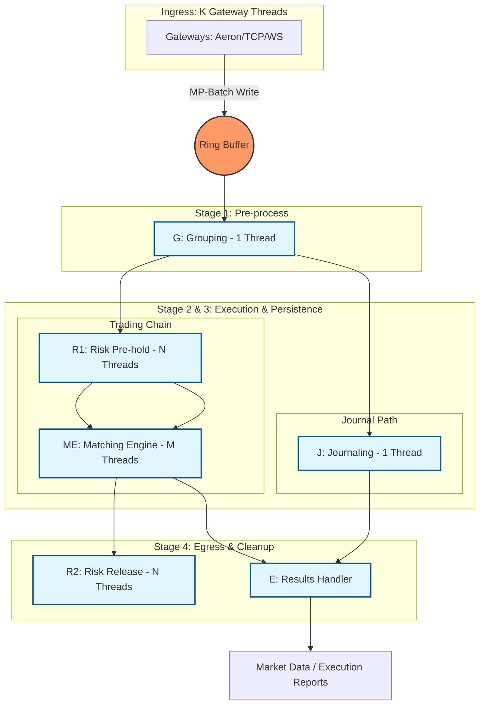

# Exchange-CPP Architecture

This document provides a detailed explanation of the Exchange-CPP architecture, focusing on the Ring Buffer, Disruptor pattern, Sequence dependencies, and the actual class composition.

## Table of Contents

1. [Overview](#overview)
2. [Ring Buffer Fundamentals](#ring-buffer-fundamentals)
3. [Disruptor Pattern](#disruptor-pattern)
4. [Sequence and Dependencies](#sequence-and-dependencies)
5. [Pipeline Architecture](#pipeline-architecture)
6. [Class Composition](#class-composition)
7. [Data Flow](#data-flow)

## Overview

Exchange-CPP uses a **lock-free, multi-stage asynchronous pipeline** based on the Disruptor pattern. All inter-thread communication happens through a single Ring Buffer, with dependencies managed via Sequence barriers.



## Ring Buffer Fundamentals

### What is a Ring Buffer?

A **Ring Buffer** (also called Circular Buffer) is a fixed-size array that wraps around when it reaches the end. In Exchange-CPP, it stores `OrderCommand` objects pre-allocated at startup.

```cpp
// Ring Buffer Type
using RingBufferT = disruptor::MultiProducerRingBuffer<
    common::cmd::OrderCommand,  // Event type
    WaitStrategyT               // Wait strategy (Blocking/Yielding/BusySpin)
>;

// Creation
const int ringBufferSize = 32768;  // Must be power of 2
auto eventFactory = std::make_shared<OrderCommandEventFactory>();
auto *waitStrategy = GetWaitStrategyInstance<WaitStrategyT>();

disruptor_ = std::make_unique<DisruptorT>(
    eventFactory, ringBufferSize, *threadFactory, *waitStrategy);
auto &ringBuffer = disruptor_->getRingBuffer();
```

### Key Properties

1. **Fixed Size**: Pre-allocated at startup (typically 32K slots)
2. **Power of 2**: Size must be power of 2 for efficient modulo operations
3. **Zero-Copy**: Events are pre-allocated, only references are passed
4. **Lock-Free**: Uses atomic operations and memory barriers
5. **Multi-Producer**: Multiple gateway threads can write concurrently

### Ring Buffer Operations

#### Producer (Gateway Threads)

```cpp
// 1. Claim a sequence (slot) in the ring buffer
int64_t seq = ringBuffer->next();

// 2. Get the event at that sequence
auto &event = ringBuffer->get(seq);

// 3. Write data into the event
event.orderId = 12345;
event.price = 10000;
event.size = 100;

// 4. Publish the event (makes it visible to consumers)
ringBuffer->publish(seq);
```

#### Consumer (Processor Threads)

```cpp
// 1. Wait for available sequence (via SequenceBarrier)
int64_t availableSeq = sequenceBarrier->waitFor(nextSequence);

// 2. Process events in batch
for (int64_t seq = nextSequence; seq <= availableSeq; seq++) {
    auto &event = ringBuffer->get(seq);
    eventHandler->OnEvent(seq, &event);
}

// 3. Update sequence (mark as processed)
sequence.set(availableSeq);
```

### Ring Buffer Wrap Prevention

The Ring Buffer must prevent **wrapping** (overwriting unprocessed events). This is achieved by:

1. **Gating Sequences**: Producers track the slowest consumer sequence
2. **Sequence Barriers**: Consumers wait for dependencies before processing
3. **Size Check**: `ringBuffer->next()` blocks if buffer would wrap

```cpp
// Producer checks: can I write at sequence N?
// Only if: N - slowestConsumerSequence < ringBufferSize
int64_t nextSeq = ringBuffer->next();  // May block here
```

## Disruptor Pattern

### Core Concepts

The **Disruptor** is a framework for coordinating work between threads using a Ring Buffer. It separates three concerns:

1. **Storage**: Ring Buffer (data structure)
2. **Coordination**: Sequence Barriers (dependency management)
3. **Processing**: Event Processors (business logic)

### Disruptor Components

```cpp
// Disruptor DSL (Domain-Specific Language)
using DisruptorT = disruptor::dsl::Disruptor<
    common::cmd::OrderCommand,           // Event type
    disruptor::dsl::ProducerType::MULTI, // Multi-producer
    WaitStrategyT                        // Wait strategy
>;

// Disruptor manages:
// - Ring Buffer creation
// - Event Processor registration
// - Dependency graph construction
// - Thread lifecycle
```

### Wait Strategies

Different wait strategies trade off latency vs CPU usage:

| Strategy | Latency | CPU Usage | Use Case |
|----------|---------|-----------|----------|
| **BusySpinWaitStrategy** | Lowest | Highest | Ultra-low latency, dedicated cores |
| **YieldingWaitStrategy** | Low | Medium | Balanced performance |
| **BlockingWaitStrategy** | Higher | Lowest | General purpose, predictable |

```cpp
// Wait strategy selection
auto *waitStrategy = GetWaitStrategyInstance<disruptor::BlockingWaitStrategy>();
```

## Sequence and Dependencies

### What is a Sequence?

A **Sequence** is an atomic counter that tracks progress through the Ring Buffer:

- **Producer Sequence**: Next slot to write (cursor)
- **Consumer Sequence**: Last slot processed

```cpp
class Sequence {
    std::atomic<int64_t> value_;
public:
    int64_t get() const;
    void set(int64_t value);
    // ...
};
```

### Sequence Barriers

A **SequenceBarrier** coordinates dependencies between consumers:

```cpp
// Create barrier that waits for dependencies
auto barrier = ringBuffer->newBarrier(
    barrierSequences,  // Array of dependency sequences
    count              // Number of dependencies
);

// Wait for available sequence
int64_t availableSeq = barrier->waitFor(nextSequence);
```

### Dependency Graph

The dependency graph ensures correct ordering:

```
Ring Buffer (Producer)
    ↓
Grouping (G) - Sequence G
    ├─→ Risk Pre-hold (R1) - Sequence R1 (depends on G)
    │       ↓
    │   Matching Engine (ME) - Sequence ME (depends on R1)
    │       ├─→ Risk Release (R2) - Sequence R2 (depends on ME)
    │       └─→ Results Handler (E) - Sequence E (depends on ME)
    │
    └─→ Journaling (J) - Sequence J (depends on G)
            ↓
        Results Handler (E) - Sequence E (depends on J)
```

**Key Points**:
- **E depends on both ME and J**: Must wait for both to complete
- **R2 depends on ME**: Can process in parallel with E
- **R1 depends on G**: Serial path (trading chain)
- **J depends on G**: Parallel path (journaling)

### Implementation Example

```cpp
// Stage 1: Grouping (depends on Ring Buffer)
auto groupingBarrier = ringBuffer->newBarrier(nullptr, 0);
auto groupingProcessor = createGroupingProcessor(ringBuffer, groupingBarrier);

// Stage 2: Risk Pre-hold (depends on Grouping)
disruptor::Sequence *groupingSeq = &groupingProcessor->getSequence();
auto r1Barrier = ringBuffer->newBarrier(&groupingSeq, 1);
auto r1Processor = createRiskProcessor(ringBuffer, r1Barrier);

// Stage 3: Matching Engine (depends on Risk Pre-hold)
disruptor::Sequence *r1Seq = &r1Processor->getSequence();
auto meBarrier = ringBuffer->newBarrier(&r1Seq, 1);
auto meProcessor = createMatchingProcessor(ringBuffer, meBarrier);

// Stage 4: Results Handler (depends on ME and Journaling)
disruptor::Sequence *meSeq = &meProcessor->getSequence();
disruptor::Sequence *journalSeq = &journalProcessor->getSequence();
disruptor::Sequence *dependencies[] = {meSeq, journalSeq};
auto resultsBarrier = ringBuffer->newBarrier(dependencies, 2);
auto resultsProcessor = createResultsProcessor(ringBuffer, resultsBarrier);
```

## Pipeline Architecture

### Stage 1: Grouping (G)

**Class**: `GroupingProcessor`  
**Threads**: 1  
**Dependencies**: Ring Buffer (producer)

**Responsibilities**:
- Batch small orders
- Identify cancel-replace patterns
- Pre-process commands

```cpp
class GroupingProcessor : public disruptor::EventProcessor {
    void onEvent(OrderCommand &cmd, int64_t sequence, bool endOfBatch) {
        // Batch processing logic
        // Identify cancel-replace patterns
    }
};
```

### Stage 2: Risk Pre-hold (R1)

**Class**: `TwoStepMasterProcessor` + `TwoStepSlaveProcessor`  
**Threads**: N (sharded by User ID)  
**Dependencies**: Grouping (G)

**Responsibilities**:
- Pre-match balance checks
- Speculative freezing of funds
- Risk validation

```cpp
// Two-step processor pattern:
// Master: Reads from ring buffer, coordinates batch
// Slave: Processes batch, updates sequence

class TwoStepMasterProcessor {
    void ProcessEvents() {
        // Read batch from ring buffer
        int64_t batchEnd = barrier->waitFor(nextSequence);
        
        // Trigger slave to process batch
        slaveProcessor->HandlingCycle(batchEnd);
        
        // Update sequence after slave completes
        sequence.set(batchEnd);
    }
};
```

### Stage 3: Matching Engine (ME)

**Class**: `TwoStepMasterProcessor` + `MatchingEngineRouter`  
**Threads**: M (sharded by Symbol ID)  
**Dependencies**: Risk Pre-hold (R1)

**Responsibilities**:
- Order book matching (Price-Time Priority)
- Trade execution
- Order book updates

```cpp
class MatchingEngineRouter {
    void ProcessOrder(int64_t seq, OrderCommand *cmd) {
        // Route to appropriate OrderBook by SymbolID
        int32_t symbolId = cmd->symbolId;
        IOrderBook *book = GetOrderBook(symbolId);
        
        // Process order
        book->NewOrder(cmd);
        // or book->CancelOrder(cmd);
        // etc.
    }
};
```

### Stage 3 (Parallel): Journaling (J)

**Class**: `GroupingProcessor` (journaling variant)  
**Threads**: 1  
**Dependencies**: Grouping (G)

**Responsibilities**:
- Binary persistence for state recovery
- Write to disk (FileChannel.write)
- Snapshot creation

```cpp
class JournalingProcessor {
    void onEvent(OrderCommand &cmd, int64_t sequence, bool endOfBatch) {
        // Serialize command to binary format
        serializationProcessor->WriteToJournal(&cmd, sequence, endOfBatch);
    }
};
```

### Stage 4: Risk Release (R2)

**Class**: `TwoStepSlaveProcessor`  
**Threads**: N (sharded by User ID)  
**Dependencies**: Matching Engine (ME)

**Responsibilities**:
- Final settlement
- Fee deduction
- Profit/loss release
- Balance updates

### Stage 4: Results Handler (E)

**Class**: `ResultsHandler`  
**Threads**: 1  
**Dependencies**: Matching Engine (ME) + Journaling (J)

**Responsibilities**:
- Merge ME and J results
- Generate execution reports
- Send market data
- Call results consumer callback

```cpp
class ResultsHandler {
    void onEvent(OrderCommand &cmd, int64_t sequence, bool endOfBatch) {
        // Merge results from ME and J
        // Generate execution reports
        resultsConsumer_(&cmd, sequence);
    }
};
```

## Class Composition

### Core Classes

```
ExchangeCore
├── Disruptor<OrderCommand, MULTI, WaitStrategy>
│   └── RingBuffer<OrderCommand, WaitStrategy>
│       └── OrderCommand[] (pre-allocated array)
│
├── ExchangeApi<WaitStrategy>
│   └── RingBuffer* (reference)
│
└── Processors:
    ├── GroupingProcessor
    │   ├── SequenceBarrier (depends on RingBuffer)
    │   └── EventHandler
    │
    ├── RiskEngine (R1) - N instances
    │   ├── TwoStepMasterProcessor
    │   │   ├── SequenceBarrier (depends on Grouping)
    │   │   └── TwoStepSlaveProcessor
    │   └── RiskEngine logic
    │
    ├── MatchingEngineRouter (ME) - M instances
    │   ├── TwoStepMasterProcessor
    │   │   ├── SequenceBarrier (depends on R1)
    │   │   └── TwoStepSlaveProcessor
    │   └── OrderBook[] (one per symbol)
    │
    ├── JournalingProcessor (J)
    │   ├── SequenceBarrier (depends on Grouping)
    │   └── ISerializationProcessor
    │
    ├── RiskEngine (R2) - N instances
    │   ├── TwoStepSlaveProcessor
    │   │   └── SequenceBarrier (depends on ME)
    │   └── RiskEngine logic
    │
    └── ResultsHandler (E)
        ├── SequenceBarrier (depends on ME + J)
        └── ResultsConsumer callback
```

### Two-Step Processor Pattern

The **Two-Step Processor** pattern is used for sharded processors (R1, ME, R2):

```cpp
// Master: Coordinates batch processing
class TwoStepMasterProcessor {
    void ProcessEvents() {
        // 1. Wait for available batch
        int64_t batchEnd = barrier->waitFor(nextSequence);
        
        // 2. Trigger slave to process batch
        slaveProcessor->HandlingCycle(batchEnd);
        
        // 3. Update sequence after slave completes
        sequence.set(batchEnd);
    }
};

// Slave: Processes actual events
class TwoStepSlaveProcessor {
    void HandlingCycle(int64_t processUpToSequence) {
        while (nextSequence < processUpToSequence) {
            // 1. Wait for available sequence
            int64_t availableSeq = barrier->waitFor(nextSequence);
            
            // 2. Process batch
            for (int64_t seq = nextSequence; seq <= availableSeq; seq++) {
                auto &event = ringBuffer->get(seq);
                eventHandler->OnEvent(seq, &event);
                nextSequence++;
            }
        }
        
        // 3. Update sequence
        sequence.set(processUpToSequence - 1);
    }
};
```

**Why Two-Step?**
- **Master**: Manages sequence and coordinates with Disruptor
- **Slave**: Handles actual event processing (can be sharded)
- **Separation**: Allows multiple slaves per master (sharding)

## Data Flow

### Complete Order Processing Flow

```
1. Gateway Thread (Producer)
   ├─> Parse protocol (Aeron/TCP/WS)
   ├─> Create ApiPlaceOrder command
   └─> ringBuffer->publishEvent(cmd)
       └─> Sequence: 100 (example)

2. Grouping Processor (G)
   ├─> Wait for sequence 100
   ├─> Batch small orders
   ├─> Identify cancel-replace
   └─> Update Sequence G: 100

3. Risk Pre-hold (R1) - Shard by UID
   ├─> Wait for Sequence G >= 100
   ├─> Check balance
   ├─> Freeze funds
   └─> Update Sequence R1: 100

4. Matching Engine (ME) - Shard by SymbolID
   ├─> Wait for Sequence R1 >= 100
   ├─> Route to OrderBook by SymbolID
   ├─> Match orders (Price-Time Priority)
   ├─> Generate trades
   └─> Update Sequence ME: 100

5. Journaling (J) - Parallel path
   ├─> Wait for Sequence G >= 100
   ├─> Serialize to binary
   └─> Write to disk
       └─> Update Sequence J: 100

6. Risk Release (R2) - Shard by UID
   ├─> Wait for Sequence ME >= 100
   ├─> Final settlement
   ├─> Deduct fees
   └─> Update balance

7. Results Handler (E)
   ├─> Wait for Sequence ME >= 100 AND Sequence J >= 100
   ├─> Merge results
   ├─> Generate execution report
   └─> Call resultsConsumer(cmd, 100)
```

### Sequence Progression Example

```
Time    | RB  | G   | R1  | ME  | J   | R2  | E   |
--------|-----|-----|-----|-----|-----|-----|-----|
T0      | 100 | 95  | 90  | 85  | 95  | 80  | 75  |
T1      | 101 | 96  | 91  | 86  | 96  | 81  | 76  |
T2      | 102 | 97  | 92  | 87  | 97  | 82  | 77  |
...
```

**Observations**:
- **RB (Producer)**: Always ahead (writes new events)
- **G**: Close behind RB (fast single-threaded)
- **R1, ME**: Serial chain, each waits for previous
- **J**: Parallel to R1/ME chain (depends only on G)
- **E**: Waits for both ME and J (slowest)
- **R2**: Parallel to E (depends only on ME)

### Zero-Copy Memory Model

```cpp
// OrderCommand is pre-allocated in Ring Buffer
class OrderCommand {
    int64_t orderId;
    int64_t price;
    int64_t size;
    // ... other fields
};

// All processors work with references (no copying)
void ProcessOrder(int64_t seq, OrderCommand *cmd) {
    // cmd points to pre-allocated slot in ring buffer
    // No memory allocation during processing
    cmd->resultCode = CommandResultCode::SUCCESS;
}
```

## Key Design Principles

1. **Lock-Free**: All coordination via atomic operations and memory barriers
2. **Zero-Copy**: Pre-allocated events, only references passed
3. **Deterministic**: Same input sequence → same memory state
4. **Sharding**: Parallel processing by User ID (Risk) or Symbol ID (Matching)
5. **Dependency Management**: Sequence barriers ensure correct ordering
6. **Thread Affinity**: Each processor pinned to specific CPU core

## References

- [LMAX Disruptor Documentation](https://lmax-exchange.github.io/disruptor/)
- [disruptor-cpp](https://github.com/SkynetNext/disruptor-cpp)
- Project README: System Architecture section

---

**Last Updated**: 2025-01-XX

