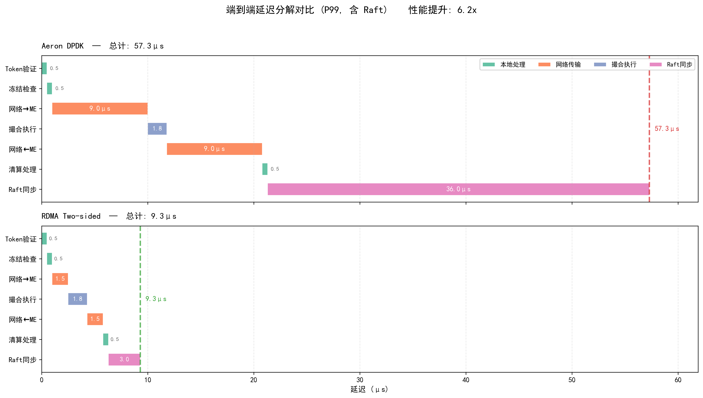

# 分布式撮合系统架构设计 V2

> **文档版本**: 2.0  
> **状态**: 设计规范  
> **最后更新**: 2026-01-24

## 目录

1. [设计目标与约束](#1-设计目标与约束)
2. [系统架构总览](#2-系统架构总览)
   - [2.1 分层架构](#21-分层架构)
   - [2.2 核心设计原则](#22-核心设计原则)
3. [核心组件设计](#3-核心组件设计)
4. [状态机与数据流](#4-状态机与数据流)
5. [一致性与容错](#5-一致性与容错)
6. [性能工程](#6-性能工程)
7. [运维与可观测性](#7-运维与可观测性)
8. [容量规划](#8-容量规划)
9. [安全设计](#9-安全设计)
10. [演进路线](#10-演进路线)
11. [附录](#附录)

---

## 1. 设计目标与约束

### 1.1 核心目标

| 指标 | 目标值 (P99) | 测量方法 |
|------|--------------|----------|
| **撮合延迟** | ≤ 5μs | 纯撮合引擎处理时间 |
| **端到端延迟 (不含 Raft)** | ≤ 25μs | Gateway → 撮合完成，异步复制 |
| **端到端延迟 (含 Raft)** | ≤ 60μs | Gateway → 撮合完成，同步复制 |
| **吞吐量** | ≥ 4M orders/sec | 单撮合集群 (实测) |
| **故障切换时间** | ≤ 500ms | Leader 宕机到新 Leader 可用 |
| **数据持久性** | 99.999999% | 已提交订单不丢失 |
| **可用性** | 99.99% | 年度停机 < 52.6 分钟 |

> **延迟目标说明** (基于 Aeron Premium + DPDK):
> - **撮合延迟**: 纯内存操作，Disruptor 架构
> - **端到端 (不含 Raft)**: 网络 RTT 18μs + 撮合 5μs + 本地操作 ~1μs ≈ 24μs
> - **端到端 (含 Raft)**: 上述 + Raft 同步 36μs ≈ 60μs
> - 详细延迟分解见 [附录 D. 延迟分析](#d-延迟分析)

### 1.2 设计约束

| 约束 | 说明 | 原因 |
|------|------|------|
| **单币对单集群** | 每个交易对由独立集群处理 | 避免跨分区协调，保证确定性 |
| **用户分片** | 账户按用户 ID 分片 | 冻结/清算本地化，无分布式事务 |
| **确定性执行** | 相同输入序列 → 相同状态 | 支持状态机复制，故障恢复 |
| **无跨分区事务** | 禁止 2PC/3PC | 延迟不可控，复杂度高 |

### 1.3 非目标

- **跨币对原子交易**: 不支持（可通过应用层实现）
- **亚微秒延迟**: 需要 FPGA/专用硬件，不在本设计范围
- **无限水平扩展**: 单集群有上限，通过多集群扩展

---

## 2. 系统架构总览

### 2.1 分层架构

```
┌─────────────────────────────────────────────────────────────────────────────────────────────┐
│                                    接入层 (Access Layer)                                     │
│  ┌─────────────┐  ┌─────────────┐  ┌─────────────┐                                         │
│  │  Gateway A  │  │  Gateway B  │  │  Gateway C  │  ...                                    │
│  │  (uWS+TLS)  │  │  (uWS+TLS)  │  │  (uWS+TLS)  │                                         │
│  └──────┬──────┘  └──────┬──────┘  └──────┬──────┘                                         │
│         │                │                │                                                 │
│         │ ① Token 验证 (本地 LRU + Redis)                                                   │
│         │ ② 路由决策 (Coordinator 元数据)                                                   │
│         ▼                ▼                ▼                                                 │
└─────────┼────────────────┼────────────────┼─────────────────────────────────────────────────┘
          │                │                │
          ▼                ▼                ▼
┌─────────────────────────────────────────────────────────────────────────────────────────────┐
│                          交易服务层 (Trading Service Layer)                                  │
│                          按用户分片 | 虚拟分片 16384 slots | Raft 复制                        │
│                                                                                             │
│  ┌─────────────────────────────────────────────────────────────────────────────────────┐   │
│  │  Coordinator (元数据服务)                                                            │   │
│  │  • slot → shard 映射                                                                │   │
│  │  • shard → {leader, followers} 映射                                                 │   │
│  │  • 币对 → 撮合集群映射                                                               │   │
│  │  • 版本号 (Raft Term) 管理                                                          │   │
│  └─────────────────────────────────────────────────────────────────────────────────────┘   │
│                                                                                             │
│  ┌─────────────────────┐  ┌─────────────────────┐  ┌─────────────────────┐                 │
│  │ Shard 0             │  │ Shard 1             │  │ Shard N             │                 │
│  │ slots: 0-1023       │  │ slots: 1024-2047    │  │ slots: ...          │                 │
│  │ ┌───────┬─────────┐ │  │ ┌───────┬─────────┐ │  │ ┌───────┬─────────┐ │                 │
│  │ │Leader │ Follower│ │  │ │Leader │ Follower│ │  │ │Leader │ Follower│ │                 │
│  │ │       │ ×2      │ │  │ │       │ ×2      │ │  │ │       │ ×2      │ │                 │
│  │ └───────┴─────────┘ │  │ └───────┴─────────┘ │  │ └───────┴─────────┘ │                 │
│  │                     │  │                     │  │                     │                 │
│  │ ③ 账户状态          │  │ ③ 账户状态          │  │ ③ 账户状态          │                 │
│  │ • 余额 (balance)    │  │ • 余额 (balance)    │  │ • 余额 (balance)    │                 │
│  │ • 冻结 (frozen)     │  │ • 冻结 (frozen)     │  │ • 冻结 (frozen)     │                 │
│  │ • 持仓 (position)   │  │ • 持仓 (position)   │  │ • 持仓 (position)   │                 │
│  │ • 风险指标          │  │ • 风险指标          │  │ • 风险指标          │                 │
│  └──────────┬──────────┘  └──────────┬──────────┘  └──────────┬──────────┘                 │
│             │                        │                        │                            │
│             │ ④ 按币对路由到撮合集群   │                        │                            │
│             └────────────────────────┼────────────────────────┘                            │
│                                      │                                                     │
│  ⑧ 风险监控: margin_ratio < threshold → 强平指令 → 撮合引擎                                │
│                                                                                             │
└──────────────────────────────────────┼─────────────────────────────────────────────────────┘
                                       │
                                       ▼
┌─────────────────────────────────────────────────────────────────────────────────────────────┐
│                          撮合层 (Matching Layer)                                             │
│                          按币对分区 | 每集群 Raft 3 副本 | 纯撮合引擎                         │
│                                                                                             │
│  ┌────────────────────────────┐    ┌────────────────────────────┐                          │
│  │ 集群 A: BTC/USDT           │    │ 集群 B: ETH/USDT           │   ...                    │
│  │ ┌────────┬────────┬──────┐ │    │ ┌────────┬────────┬──────┐ │                          │
│  │ │ Leader │Follower│Follower│    │ │ Leader │Follower│Follower│                          │
│  │ └────────┴────────┴──────┘ │    │ └────────┴────────┴──────┘ │                          │
│  │                            │    │                            │                          │
│  │ ⑤ 撮合执行                 │    │ ⑤ 撮合执行                 │                          │
│  │ • 订单入簿/成交            │    │ • 订单入簿/成交            │                          │
│  │ • Raft 日志复制            │    │ • Raft 日志复制            │                          │
│  │ • 行情生成                 │    │ • 行情生成                 │                          │
│  └────────────────────────────┘    └────────────────────────────┘                          │
│             │                                   │                                          │
│             │ ⑥ 按买卖双方路由                   │                                          │
│             └───────────────────────────────────┘                                          │
│                                      │                                                     │
└──────────────────────────────────────┼─────────────────────────────────────────────────────┘
                                       │
                                       ▼
┌─────────────────────────────────────────────────────────────────────────────────────────────┐
│                          交易服务层 (清算处理)                                               │
│                                                                                             │
│  ⑦ 清算处理 (按买卖双方路由到各自 Shard)                                                    │
│     • 幂等检查: processed_trades.contains(trade_id)                                        │
│     • 解冻: unfreeze(frozen_id)                                                            │
│     • 扣款/扣币: debit(user, asset, amount)                                                │
│     • 加币/加款: credit(user, asset, amount)                                               │
│     • 写入 Raft 日志                                                                       │
│                                                                                             │
└──────────────────────────────────────┬─────────────────────────────────────────────────────┘
                                       │
                                       │ ⑨ 结算指令 (异步批量)
                                       ▼
┌─────────────────────────────────────────────────────────────────────────────────────────────┐
│                              结算层 (Settlement Layer)                                       │
│                              最终一致性 | 异步批量处理                                        │
│                                                                                             │
│  资金划转 | 出入金 | 托管系统/银行对接 | 日终批量结算 | 对账与审计                            │
└─────────────────────────────────────────────────────────────────────────────────────────────┘
```

### 2.2 核心设计原则

| 原则 | 实现方式 | 收益 |
|------|----------|------|
| **交易服务作为入口** | Client → 交易服务 → 撮合 | 冻结/清算本地化，延迟最低 |
| **按用户分片** | slot = CRC16(uid) % 16384 | 账户操作无跨分区 |
| **按币对分区** | 每币对独立集群 | 故障隔离，独立扩展 |
| **撮合纯粹化** | 无认证、无冻结、无清算 | 最小化撮合路径 |
| **Aeron UDP 通信** | 交易服务 ↔ 撮合 | 低延迟高吞吐 |
| **Raft 共识** | 每层独立 Raft 组 | 强一致性，自动选主 |

---

## 3. 核心组件设计

### 3.1 交易服务 (Trading Service)

#### 3.1.1 职责

- **入口路由**: 接收客户端请求，按用户路由
- **账户管理**: 余额、冻结、持仓、风险指标
- **冻结检查**: 下单前本地冻结资金
- **清算执行**: 成交后本地清算
- **风险监控**: 实时计算保证金率，触发强平

#### 3.1.2 分片策略

```cpp
// 虚拟分片映射 (类似 Redis Cluster)
constexpr int TOTAL_SLOTS = 16384;

int getSlot(uint64_t uid) {
    return crc16(uid) % TOTAL_SLOTS;
}

int getShard(int slot) {
    return slot_to_shard_map[slot];  // 从 Coordinator 获取
}
```

**分片迁移**:
- 支持在线迁移 slots 到其他 shard
- 迁移期间：源 shard 只读，目标 shard 接收写入
- 双写阶段确保数据一致

#### 3.1.3 账户状态机

```
                    ┌─────────────────────────────────────────────────────────┐
                    │                    Account State                         │
                    │                                                          │
                    │  balance: map<asset_id, int64_t>                        │
                    │  frozen: map<frozen_id, FrozenEntry>                    │
                    │  positions: map<symbol_id, Position>                    │
                    │  processed_trades: set<trade_id>                        │
                    │                                                          │
                    └─────────────────────────────────────────────────────────┘
                                              │
              ┌───────────────────────────────┼───────────────────────────────┐
              │                               │                               │
              ▼                               ▼                               ▼
    ┌─────────────────┐             ┌─────────────────┐             ┌─────────────────┐
    │  FreezeEvent    │             │  SettleEvent    │             │  UnfreezeEvent  │
    │                 │             │                 │             │                 │
    │  frozen_id      │             │  trade_id       │             │  frozen_id      │
    │  uid            │             │  buyer_uid      │             │  uid            │
    │  asset          │             │  seller_uid     │             │  reason         │
    │  amount         │             │  price          │             │                 │
    │  order_id       │             │  quantity       │             │                 │
    │  timestamp      │             │  fee            │             │                 │
    └─────────────────┘             └─────────────────┘             └─────────────────┘
```

### 3.2 撮合引擎 (Matching Engine)

#### 3.2.1 职责

- **订单管理**: 接收、存储、修改、取消订单
- **撮合执行**: 价格-时间优先 (Price-Time Priority)
- **行情生成**: 成交、订单簿变化、统计数据
- **状态复制**: Raft 日志复制到 Follower

### 3.3 Coordinator (元数据服务)

#### 3.3.1 职责

- **分片映射**: slot → shard，shard → nodes
- **集群发现**: 币对 → 撮合集群
- **版本管理**: 使用 Raft Term 作为版本号，防止脑裂
- **健康检查**: 节点存活状态

#### 3.3.2 数据模型

```cpp
// 分片信息
struct ShardInfo {
    int shard_id;
    std::vector<int> slots;  // 负责的 slot 范围
    NodeInfo leader;
    std::vector<NodeInfo> followers;
    int64_t leadership_term;  // Raft Leader 任期（参考 Aeron Cluster）
};

// 撮合集群信息
struct MatchingClusterInfo {
    std::string symbol;
    NodeInfo leader;
    std::vector<NodeInfo> followers;
    int64_t leadership_term;  // Raft Leader 任期
};

// Coordinator 状态
class Coordinator {
    // slot → shard 映射
    std::array<int, 16384> slot_to_shard_;
    
    // shard → 节点信息
    std::unordered_map<int, ShardInfo> shards_;
    
    // 币对 → 撮合集群
    std::unordered_map<std::string, MatchingClusterInfo> matching_clusters_;
    
    // 注：不需要全局 epoch，各分片使用自己的 Raft Term
};
```

---

## 4. 状态机与数据流

### 4.1 订单生命周期状态机

```
                                    ┌─────────────────────────────────────────────────────────────┐
                                    │                     Order State Machine                      │
                                    └─────────────────────────────────────────────────────────────┘

     ┌──────────┐                                                                    ┌──────────┐
     │  CLIENT  │                                                                    │  CLIENT  │
     │  下单    │                                                                    │  收到    │
     └────┬─────┘                                                                    │  结果    │
          │                                                                          └────▲─────┘
          │ PlaceOrder                                                                    │
          ▼                                                                               │
    ┌───────────┐     冻结失败      ┌───────────┐                                        │
    │  PENDING  │ ───────────────► │ REJECTED  │ ───────────────────────────────────────┤
    │  (待冻结) │                   │  (拒绝)   │                                        │
    └─────┬─────┘                   └───────────┘                                        │
          │                                                                               │
          │ 冻结成功                                                                       │
          ▼                                                                               │
    ┌───────────┐     撮合拒绝      ┌───────────┐                                        │
    │  FROZEN   │ ───────────────► │ REJECTED  │ ───────────────────────────────────────┤
    │  (已冻结) │                   │  (解冻)   │                                        │
    └─────┬─────┘                   └───────────┘                                        │
          │                                                                               │
          │ 发送到撮合                                                                     │
          ▼                                                                               │
    ┌───────────┐                                                                        │
    │  SENT     │                                                                        │
    │  (已发送) │                                                                        │
    └─────┬─────┘                                                                        │
          │                                                                               │
          ├─────────────────────────────────────────────────────────────────┐            │
          │                                                                 │            │
          │ 入簿                                                            │ 立即成交    │
          ▼                                                                 ▼            │
    ┌───────────┐     部分成交      ┌───────────┐     全部成交      ┌───────────┐       │
    │  OPEN     │ ───────────────► │ PARTIAL   │ ───────────────► │  FILLED   │ ──────┤
    │  (挂单中) │                   │  (部分)   │                   │  (完成)   │       │
    └─────┬─────┘                   └─────┬─────┘                   └───────────┘       │
          │                               │                                              │
          │ 用户取消                       │ 用户取消                                      │
          ▼                               ▼                                              │
    ┌───────────┐                   ┌───────────┐                                        │
    │ CANCELLED │                   │ CANCELLED │ ───────────────────────────────────────┘
    │  (已取消) │                   │  (部分)   │
    └───────────┘                   └───────────┘
```

### 4.2 完整交易流程时序图

```
时间 ─────────────────────────────────────────────────────────────────────────────────────────────►

Client A          Gateway          Trading Shard X      Matching BTC/USDT      Trading Shard Y          Client B
(买方)              │                   (A 所在)              │                   (B 所在)               (卖方)
   │                │                      │                  │                      │                      │
   │ ① 下买单       │                      │                  │                      │                      │
   │ BTC/USDT       │                      │                  │                      │                      │
   │ price=50000    │                      │                  │                      │                      │
   │ qty=1          │                      │                  │                      │                      │
   │───────────────►│                      │                  │                      │                      │
   │                │                      │                  │                      │                      │
   │                │ ② Token 验证         │                  │                      │                      │
   │                │ (本地 LRU 命中)       │                  │                      │                      │
   │                │ ~500ns               │                  │                      │                      │
   │                │                      │                  │                      │                      │
   │                │ ③ 路由到 Shard X     │                  │                      │                      │
   │                │───────────────────────►                 │                      │                      │
   │                │                      │                  │                      │                      │
   │                │                      │ ④ 冻结检查       │                      │                      │
   │                │                      │ balance[USDT]=100k                      │                      │
   │                │                      │ freeze(50k USDT) │                      │                      │
   │                │                      │ ~500ns           │                      │                      │
   │                │                      │                  │                      │                      │
   │                │                      │ ⑤ Raft 日志复制  │                      │                      │
   │                │                      │ (异步，不阻塞)   │                      │                      │
   │                │                      │                  │                      │                      │
   │                │                      │ ⑥ 网络传输 ~9μs  │                      │                      │
   │                │                      │ 发送到撮合       │                      │                      │
   │                │                      │─────────────────►│                      │                      │
   │                │                      │                  │                      │                      │
   │                │                      │                  │ ⑦ 撮合执行           │                      │
   │                │                      │                  │ 买单 A 与 卖单 B     │                      │
   │                │                      │                  │ 价格=50000, 数量=1   │                      │
   │                │                      │                  │ ~5μs                 │                      │
   │                │                      │                  │                      │                      │
   │                │                      │                  │ ⑧ Raft 日志复制      │                      │
   │                │                      │                  │ (同步) ~36μs         │                      │
   │                │                      │                  │                      │                      │
   │                │                      │                  │ ⑨ 成交结果返回       │                      │
   │                │                      │◄─────────────────│─────────────────────►│                      │
   │                │                      │                  │                      │                      │
   │                │                      │ ⑩ 清算 (买方)    │                      │ ⑩ 清算 (卖方)        │
   │                │                      │ 幂等检查 trade_id│                      │ 幂等检查 trade_id    │
   │                │                      │ unfreeze(50k)    │                      │ unfreeze(1 BTC)      │
   │                │                      │ debit(50k USDT)  │                      │ debit(1 BTC)         │
   │                │                      │ credit(1 BTC)    │                      │ credit(50k USDT)     │
   │                │                      │ ~500ns           │                      │ ~500ns               │
   │                │                      │                  │                      │                      │
   │                │◄─────────────────────│                  │                      │─────────────────────►│
   │◄───────────────│                      │                  │                      │                      │
   │                │                      │                  │                      │                      │
   │ ⑪ 收到成交通知 │                      │                  │                      │         ⑪ 收到成交通知
   │ trade_id=T1    │                      │                  │                      │         trade_id=T1  │
   │ price=50000    │                      │                  │                      │         price=50000  │
   │ qty=1          │                      │                  │                      │         qty=1        │
   │                │                      │                  │                      │                      │
```

**总延迟分解对比 (P99)**

| 阶段 | Aeron Premium (DPDK) | RDMA Two-sided (实测) | 说明 |
|------|---------------------|----------------------|------|
| Token 验证 | ~500ns | ~500ns | 本地 LRU 命中 |
| 冻结检查 | ~500ns | ~500ns | 本地内存操作 |
| 网络 (→撮合) | ~9μs | **~1.5μs** | 单程传输 (P99 估算) |
| 撮合执行 | ~1μs | ~1μs | 内存操作 (优化后 P99) |
| 网络 (←撮合) | ~9μs | **~1.5μs** | 单程传输 (P99 估算) |
| 清算处理 | ~500ns | ~500ns | 本地内存操作，异步 |
| **端到端 (不含Raft)** | **~20.5μs** | **~5.5μs** | **提升 3.7x** |
| Raft 日志同步 | ~36μs | **~3μs** | RTT，强一致性保证 |
| **端到端 (含Raft)** | **~56.5μs** | **~8.5μs** | **提升 6.6x** |

**延迟分解可视化**



**网络方案对比**

| 方案 | 硬件 | 单程延迟 | RTT | 带宽 | 适用场景 |
|------|------|---------|-----|------|---------|
| **Aeron Premium (DPDK)** | 通用网卡 | ~9μs | ~18μs | 10-100 Gbps | 云端/IDC 通用方案 |
| **RDMA One-sided (规格)** | NVIDIA ConnectX-7 | < 0.6μs | < 1.2μs | 400 Gbps | 纯数据搬运 (AI/HPC) |
| **RDMA Two-sided ([实测][1])** | ConnectX-6 HDR | ~1.07μs (avg) | ~2.1μs | 200 Gbps | RPC/消息传递场景 |

[1]: https://hpcadvisorycouncil.atlassian.net/wiki/spaces/HPCWORKS/pages/1284538459


### 4.3 消息格式

#### 4.3.1 订单请求 (Trading Service → Matching Engine)

```cpp
struct OrderRequest {
    // 消息头
    uint8_t  msg_type;        // 消息类型
    uint8_t  version;         // 协议版本
    uint16_t flags;           // 标志位
    uint32_t payload_size;    // 负载大小
    
    // 路由信息
    uint64_t request_id;      // 请求 ID (用于关联响应)
    uint64_t frozen_id;       // 冻结 ID (用于清算)
    int64_t  timestamp_ns;    // 纳秒时间戳
    
    // 订单信息
    uint64_t order_id;        // 订单 ID
    uint64_t uid;             // 用户 ID
    int32_t  symbol_id;       // 交易对 ID
    int8_t   side;            // 买/卖
    int8_t   order_type;      // 限价/市价
    int8_t   time_in_force;   // GTC/IOC/FOK
    int8_t   reserved;        // 保留
    int64_t  price;           // 价格 (定点数)
    int64_t  quantity;        // 数量 (定点数)
    
    // CRC32 校验
    uint32_t checksum;
};
// 总大小: 72 bytes (对齐到 cache line)
```

#### 4.3.2 成交结果 (Matching Engine → Trading Service)

```cpp
struct TradeResult {
    // 消息头
    uint8_t  msg_type;
    uint8_t  version;
    uint16_t flags;
    uint32_t payload_size;
    
    // 关联信息
    uint64_t request_id;      // 对应的请求 ID
    uint64_t trade_id;        // 成交 ID (全局唯一)
    int64_t  sequence_id;     // 撮合序列号
    int64_t  timestamp_ns;    // 成交时间戳
    
    // 成交信息
    uint64_t taker_order_id;
    uint64_t maker_order_id;
    uint64_t taker_uid;
    uint64_t maker_uid;
    uint64_t taker_frozen_id;
    uint64_t maker_frozen_id;
    int32_t  symbol_id;
    int8_t   taker_side;
    int8_t   reserved[3];
    int64_t  price;
    int64_t  quantity;
    int64_t  taker_fee;
    int64_t  maker_fee;
    
    // CRC32 校验
    uint32_t checksum;
};
// 总大小: 128 bytes
```

---

## 5. 一致性与容错

### 5.1 一致性模型

| 层级 | 一致性级别 | 实现方式 | 说明 |
|------|------------|----------|------|
| **交易服务** | 强一致性 | Raft | 账户状态必须强一致 |
| **撮合引擎** | 强一致性 | Raft | 订单簿状态必须强一致 |
| **结算服务** | 最终一致性 | 异步批量 | 允许延迟，保证最终一致 |
| **行情推送** | 最终一致性 | 异步推送 | 允许短暂延迟 |

### 5.2 Raft 配置

```cpp
// Raft 配置参数
struct RaftConfig {
    // 选举超时 (随机化避免活锁)
    int64_t election_timeout_min_ms = 150;
    int64_t election_timeout_max_ms = 300;
    
    // 心跳间隔
    int64_t heartbeat_interval_ms = 50;
    
    // 日志复制
    int max_entries_per_append = 1000;
    int64_t snapshot_interval_entries = 100000;
    
    // 网络
    int64_t rpc_timeout_ms = 100;
    int max_retry_count = 3;
};
```

### 5.3 故障模式分析 (FMEA)

| 故障模式 | 检测方式 | 恢复策略 | RTO | RPO |
|----------|----------|----------|-----|-----|
| **单节点宕机** | 心跳超时 | Raft 自动选主 | < 500ms | 0 |
| **网络分区 (少数派)** | 无法获得多数票 | 等待网络恢复 | 网络恢复后 | 0 |
| **网络分区 (多数派)** | 正常运行 | 少数派自动降级 | 0 | 0 |
| **磁盘故障** | I/O 错误 | 从快照恢复 | 分钟级 | 0 |
| **内存损坏** | 校验和失败 | 重启并从日志恢复 | 秒级 | 0 |
| **脑裂** | Term 检查 | 旧 Leader 自动降级 | < 500ms | 0 |

### 5.4 脑裂防护

```cpp
// 每个请求携带 leadership_term（参考 Aeron Cluster 的 logLeadershipTermId）
struct RequestHeader {
    int shard_id;
    int64_t leadership_term;  // 客户端缓存的 Raft Term
    int64_t request_id;
};

// Leader 处理请求时检查 term
void handleRequest(const RequestHeader& header, const Request& req) {
    if (header.leadership_term < current_term_) {
        // 客户端使用过期的路由信息（类似 Aeron Cluster 的 NewLeadershipTerm）
        return sendRedirect(current_leader_, current_term_);
    }
    
    if (!isLeader()) {
        // 本节点不再是 Leader
        return sendRedirect(current_leader_, current_term_);
    }
    
    // 正常处理请求
    processRequest(req);
}

// Raft 选举成功后，新 Leader 上报元数据
void onBecomeLeader(int64_t new_term) {
    current_term_ = new_term;  // Raft 保证 Term 单调递增
    // 通知 Coordinator 更新元数据
    coordinator_.updateLeader(shard_id_, node_id_, new_term);
}
```

### 5.5 故障切换时序

```
时间 ────────────────────────────────────────────────────────────────────────────────────────────►

                    T0              T0+150ms           T0+200ms           T0+300ms           T0+350ms
                    │                  │                  │                  │                  │
Leader (Node A)     X (宕机)           │                  │                  │                  │
                    │                  │                  │                  │                  │
Follower (Node B)   │           检测心跳超时        发起选举           当选 Leader         开始处理请求
                    │                  │                  │                  │                  │
Follower (Node C)   │           检测心跳超时        投票给 B           确认 B 为 Leader     转发请求到 B
                    │                  │                  │                  │                  │
Client              │                  │                  │           重连任意节点        收到 REDIRECT
                    │                  │                  │                  │           连接到 B
                    │                  │                  │                  │                  │
Coordinator         │                  │                  │           收到 B 的通知       更新元数据
                    │                  │                  │           term=N+1            广播给客户端
                    │                  │                  │                  │                  │

详细时序:
├─ T0:        Leader A 宕机
├─ T0+150ms:  Follower B, C 检测到心跳超时 (heartbeat_interval × 3)
├─ T0+200ms:  B 发起选举 (election_timeout 随机化)
├─ T0+250ms:  B 收到 C 的投票，获得多数票
├─ T0+300ms:  B 成为新 Leader (Raft Term = N+1)
├─ T0+320ms:  B 通知 Coordinator 更新元数据 (leadership_term = N+1)
├─ T0+350ms:  B 开始处理请求
└─ 总耗时:    < 500ms
```

### 5.6 数据恢复流程

```
┌─────────────────────────────────────────────────────────────────────────────────────────────┐
│                              节点启动恢复流程                                                │
└─────────────────────────────────────────────────────────────────────────────────────────────┘

                    ┌─────────────────┐
                    │   节点启动       │
                    └────────┬────────┘
                             │
                             ▼
                    ┌─────────────────┐
                    │ 1. 加载最新快照  │
                    │ (Snapshot)      │
                    │ ~100ms          │
                    └────────┬────────┘
                             │
                             ▼
                    ┌─────────────────┐
                    │ 2. 回放日志      │
                    │ (从快照位置到    │
                    │  日志末尾)       │
                    │ ~10-100ms       │
                    └────────┬────────┘
                             │
                             ▼
                    ┌─────────────────┐     落后太多?     ┌─────────────────┐
                    │ 3. 检查是否落后  │ ───────────────► │ 4. 从 Leader    │
                    │ (与 Leader 对比) │                   │    拉取缺失日志  │
                    └────────┬────────┘                   │    (Catchup)    │
                             │                            └────────┬────────┘
                             │ 已同步                               │
                             ▼                                      │
                    ┌─────────────────┐                            │
                    │ 5. 加入集群      │◄───────────────────────────┘
                    │ (作为 Follower)  │
                    └────────┬────────┘
                             │
                             ▼
                    ┌─────────────────┐
                    │ 6. 正常运行      │
                    │ (接收日志复制)   │
                    └─────────────────┘

快照内容:
├─ 账户状态: balance, frozen, positions
├─ 订单簿状态: bids, asks, order_index
├─ 元数据: last_applied_index, leadership_term
└─ 校验和: CRC32
```

---

## 6. 性能工程

> 延迟分析详见 [2.2 延迟分析](#22-延迟分析)

### 6.1 Aeron 配置

```cpp
// Aeron 配置 (低延迟优化)
struct AeronConfig {
    // 传输层
    std::string channel = "aeron:udp?endpoint=224.0.1.1:40456|interface=eth0";
    int stream_id = 1001;
    
    // 缓冲区
    int64_t term_buffer_length = 64 * 1024;      // 64KB
    int64_t ipc_term_buffer_length = 64 * 1024;  // 64KB
    
    // 空闲策略
    IdleStrategy idle_strategy = IdleStrategy::BUSY_SPIN;
    
    // 驱动
    bool embedded_media_driver = true;
    std::string aeron_dir = "/dev/shm/aeron";
};

// 发送消息 (零拷贝)
void sendOrder(const OrderRequest& order) {
    // 1. 获取发布位置
    int64_t position = publication_->offer(
        reinterpret_cast<const uint8_t*>(&order),
        sizeof(OrderRequest)
    );
    
    // 2. 处理背压
    if (position < 0) {
        if (position == aeron::BACK_PRESSURED) {
            // 背压: 订阅者跟不上
            handleBackPressure();
        } else if (position == aeron::NOT_CONNECTED) {
            // 未连接: 重连
            reconnect();
        }
    }
}
```
---

## 7. 运维与可观测性

### 7.1 监控指标 (SLI/SLO)

| 指标类别 | 指标名称 | SLO | 告警阈值 |
|----------|----------|-----|----------|
| **延迟** | order_latency_p99 | ≤ 50μs | > 100μs |
| **延迟** | order_latency_p999 | ≤ 100μs | > 200μs |
| **吞吐** | orders_per_second | ≥ 1M | < 500K |
| **可用性** | service_availability | ≥ 99.99% | < 99.9% |
| **错误率** | error_rate | ≤ 0.01% | > 0.1% |
| **Raft** | raft_commit_latency_p99 | ≤ 200μs | > 500μs |
| **Raft** | raft_leader_elections | 0/hour | > 1/hour |
| **资源** | cpu_usage | ≤ 70% | > 90% |
| **资源** | memory_usage | ≤ 80% | > 90% |
| **资源** | disk_usage | ≤ 70% | > 85% |

---

## 8. 容量规划

### 8.1 资源估算模型

#### 8.1.1 内存估算

```
单用户内存:
├─ 账户状态:     ~200 bytes
├─ 冻结记录:     ~50 bytes × 平均 10 条 = 500 bytes
├─ 持仓记录:     ~100 bytes × 平均 5 条 = 500 bytes
└─ 总计:         ~1.2 KB/用户

单订单内存:
├─ Order 对象:   ~200 bytes
├─ 索引条目:     ~50 bytes
└─ 总计:         ~250 bytes/订单

单交易对订单簿:
├─ 活跃订单:     10,000 × 250 bytes = 2.5 MB
├─ 价格层级:     1,000 × 100 bytes = 100 KB
└─ 总计:         ~2.6 MB/交易对

示例 (100 万用户，100 交易对):
├─ 用户数据:     1M × 1.2 KB = 1.2 GB
├─ 订单簿:       100 × 2.6 MB = 260 MB
├─ 系统开销:     ~500 MB
└─ 总计:         ~2 GB (单节点)
```

#### 8.1.2 CPU 估算

```
单订单 CPU 周期:
├─ 冻结检查:     ~500 cycles
├─ 撮合执行:     ~2,000 cycles (平均)
├─ 清算处理:     ~500 cycles
└─ 总计:         ~3,000 cycles/订单

吞吐量计算 (3.0 GHz CPU):
├─ 单核:         3.0G / 3,000 = 1M orders/sec (理论)
├─ 实际 (含开销): ~500K orders/sec/core
└─ 4 核:         ~2M orders/sec

推荐配置:
├─ 小规模 (10K TPS):   4 核
├─ 中规模 (100K TPS):  8 核
└─ 大规模 (1M TPS):    16+ 核
```

#### 8.1.3 网络带宽估算

```
单订单消息大小:
├─ 请求:         72 bytes
├─ 响应:         128 bytes
└─ 总计:         200 bytes/订单

带宽计算 (1M TPS):
├─ 订单流量:     1M × 200 bytes = 200 MB/s = 1.6 Gbps
├─ Raft 复制:    ~50% 额外 = 0.8 Gbps
├─ 行情推送:     ~0.5 Gbps
└─ 总计:         ~3 Gbps

推荐配置:
├─ 小规模:       1 Gbps
├─ 中规模:       10 Gbps
└─ 大规模:       25 Gbps+
```

### 8.2 扩展策略

| 瓶颈 | 扩展方式 | 说明 |
|------|----------|------|
| **用户数** | 增加交易服务 Shard | 每 Shard 处理 ~100K 用户 |
| **交易对数** | 增加撮合集群 | 每集群处理 1-10 交易对 |
| **单交易对 TPS** | 垂直扩展 | 更快的 CPU、更大内存 |
| **读请求** | 增加 Follower | 只读请求路由到 Follower |

### 8.3 容量规划表

| 规模 | 用户数 | 交易对 | TPS | 节点数 | 配置 |
|------|--------|--------|-----|--------|------|
| **小型** | 10K | 10 | 10K | 3 | 4C/16G |
| **中型** | 100K | 50 | 100K | 9 | 8C/32G |
| **大型** | 1M | 200 | 500K | 27 | 16C/64G |
| **超大型** | 10M | 1000 | 2M | 81+ | 32C/128G |

---

## 9. 安全设计

### 9.1 认证与授权

```
┌─────────────────────────────────────────────────────────────────────────────────────────────┐
│                              认证流程                                                        │
└─────────────────────────────────────────────────────────────────────────────────────────────┘

┌─────────┐  ① 登录请求              ┌──────────────┐
│ Client  │  (账号+密码+2FA)         │ Auth Service │
│         │─────────────────────────►│              │
└────┬────┘                          └──────┬───────┘
     │                                      │
     │◄─── ② Access Token + Refresh Token ──┤
     │                                      │
     │                               ③ 写入 Redis
     │                               token → {uid, perms, exp}
     │
     │  ④ Authorization: Bearer {token}
     ▼
┌─────────────────────────────────────────────────┐
│  Gateway                                         │
│                                                  │
│  ┌─────────────────┐      ┌─────────────────┐   │
│  │ 本地 LRU 缓存    │ miss │     Redis       │   │
│  │ token → uid     │─────►│ token → {uid,   │   │
│  │ TTL: 10s        │◄─────│   perms, exp}   │   │
│  └─────────────────┘ fill  └─────────────────┘   │
│                                                  │
│  ⑤ 验证通过 → 路由到交易服务                      │
└─────────────────────────────────────────────────┘
```

### 9.2 权限模型

```cpp
// 权限定义
enum class Permission : uint32_t {
    READ        = 1 << 0,   // 查询订单、余额
    TRADE       = 1 << 1,   // 下单、撤单
    WITHDRAW    = 1 << 2,   // 提现
    ADMIN       = 1 << 3,   // 管理操作
};

// 权限检查
bool checkPermission(uint64_t uid, Permission required) {
    auto perms = getPermissions(uid);
    return (perms & static_cast<uint32_t>(required)) != 0;
}

// API 权限要求
// GET  /orders        → READ
// POST /orders        → TRADE
// DELETE /orders/{id} → TRADE
// POST /withdraw      → WITHDRAW
// POST /admin/*       → ADMIN
```

### 9.3 安全机制

| 机制 | 实现 | 说明 |
|------|------|------|
| **传输加密** | TLS 1.3 | 所有外部通信 |
| **2FA** | TOTP | 登录强制验证 |
| **Token 短期有效** | 15-30 分钟 | Access Token 过期时间 |
| **即时撤销** | Redis 删除 | 登出/改密时立即失效 |
| **IP 白名单** | 防火墙 | 内部服务通信 |
| **速率限制** | 令牌桶 | 防止 DDoS |
| **审计日志** | 全量记录 | 所有操作可追溯 |

### 9.4 速率限制

```cpp
// 令牌桶算法
class RateLimiter {
    int64_t tokens_;
    int64_t max_tokens_;
    int64_t refill_rate_;  // tokens/second
    int64_t last_refill_time_;
    
public:
    bool tryAcquire(int64_t tokens = 1) {
        refill();
        if (tokens_ >= tokens) {
            tokens_ -= tokens;
            return true;
        }
        return false;
    }
    
private:
    void refill() {
        auto now = nowNs();
        auto elapsed = now - last_refill_time_;
        auto new_tokens = elapsed * refill_rate_ / 1e9;
        tokens_ = std::min(tokens_ + new_tokens, max_tokens_);
        last_refill_time_ = now;
    }
};

// 限制配置
// 全局:     100K req/s
// 单用户:   1K req/s
// 单 IP:    10K req/s
```

---

## 10. 演进路线

### 10.1 实现阶段

| 阶段 | 内容 | 状态 |
|------|------|------|
| **Phase 1: 单机撮合** | 撮合引擎、ART Tree、对象池、Disruptor | ✅ 完成 |
| **Phase 2: 集群化** | Aeron Cluster (Raft)、快照恢复 | 🔄 进行中 |
| **Phase 3: 分布式** | Coordinator、交易服务分片、客户端 SDK | 📋 计划中 |
| **Phase 4: 生产化** | 监控告警、容量规划、安全加固 | 📋 计划中 |

---

## 附录

### A. 术语表

| 术语 | 定义 |
|------|------|
| **Shard** | 数据分片，按用户 ID 划分 |
| **Slot** | 虚拟分片，共 16384 个 |
| **Epoch** | 版本号，每次拓扑变更递增 |
| **Frozen ID** | 冻结记录唯一标识 |
| **Trade ID** | 成交记录唯一标识 |
| **Sequence ID** | 撮合引擎全局序列号 |

### B. 参考资料

- **Aeron**: https://github.com/aeron-io/aeron
- **Aeron Kernel Bypass (DPDK)**: https://aeron.io/aeron-premium/aeron-transport-kernel-bypass
- **Raft 论文**: https://raft.github.io/raft.pdf
- **LMAX Disruptor**: https://lmax-exchange.github.io/disruptor/
- **Redis Cluster**: https://redis.io/docs/reference/cluster-spec/
- **CME Globex**: https://www.cmegroup.com/globex.html

### C. Aeron 性能参考

> **数据来源**: [Aeron Google Cloud Performance Testing](https://aeron.io/other/aeron-google-cloud-performance-testing)  
> **测试条件**: 288 字节消息, 100K msg/s, Google Cloud C3 实例, 同 Zone 部署

| 组件 | 版本 | RTT (P99) | 单程延迟 | 吞吐量 |
|------|------|-----------|----------|--------|
| **Aeron Transport** | 开源版 | 57μs | ~28μs | 800K msg/s |
| **Aeron Transport** | Premium (DPDK) | 18μs | ~9μs | 4.7M msg/s |
| **Aeron Cluster** | 开源版 | 109μs | ~55μs | 250K msg/s |
| **Aeron Cluster** | Premium (DPDK) | 36μs | ~18μs | 2.2M msg/s |

### D. 延迟分析

> **估算基准**: Aeron Premium (DPDK)，网络 RTT P99 = 18μs，Raft RTT P99 = 36μs

#### 延迟分解表 (P99)

| 阶段 | P99 | 说明 |
|------|-----|------|
| Token 验证 (LRU 命中) | ~500ns | 本地缓存 |
| Token 验证 (Redis) | ~500μs | 缓存未命中时 |
| 冻结检查 | ~500ns | 本地内存操作 |
| Raft 日志 (交易服务) | ~36μs | 异步复制，不阻塞关键路径 |
| 网络 (→撮合) | ~9μs | Aeron Premium 单程 |
| 撮合执行 | ~5μs | 纯内存操作 |
| Raft 日志 (撮合) | ~36μs | 同步复制，等待多数确认 |
| 网络 (←撮合) | ~9μs | Aeron Premium 单程 |
| 清算处理 | ~500ns | 本地内存，异步 |

#### 端到端延迟汇总 (P99)

| 模式 | 计算 | 总延迟 |
|------|------|--------|
| **不含 Raft** | 0.5 + 0.5 + 9 + 5 + 9 + 0.5 μs | **~24μs** |
| **含 Raft** | 0.5 + 0.5 + 9 + 5 + 36 + 9 + 0.5 μs | **~60μs** |

#### 延迟优化要点

| 优化项 | 技术手段 | 效果 |
|--------|----------|------|
| Token 验证 | 本地 LRU 缓存 (TTL 10s) | 500μs → 500ns |
| 冻结/清算 | 按用户分片，本地操作 | 无网络开销 |
| 网络传输 | Aeron Premium (DPDK) | RTT 18μs |
| 撮合引擎 | Disruptor + 对象池 | ~5μs P99 |
| Raft 复制 | Aeron Cluster Premium | RTT 36μs |

### E. 变更历史

| 版本 | 日期 | 变更内容 |
|------|------|----------|
| 2.0 | 2026-01-24 | 完整重写，增加状态机、FMEA、性能工程、运维等章节 |
| 1.0 | 2025-xx-xx | 初始版本 |

---

**文档维护者**: Exchange-CPP Team  
