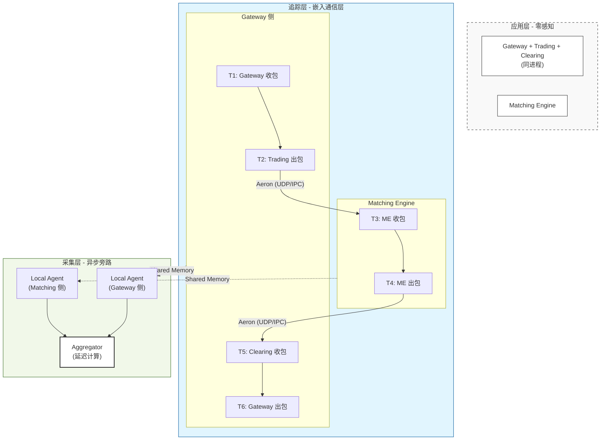

# 低延迟分布式系统可观测性方案

> **场景定位**：交易所/高频交易微秒级延迟场景的端到端延迟追踪与瓶颈定位
> 
> **核心目标**：在 <1µs 额外开销下，实现全链路延迟的精准拆解（P50/P99/P999）

---

## 1. Aeron 原生可观测性能力调研

### 1.1 Aeron 内置监控体系

Aeron 提供了基于 **Counter（计数器）** 的监控体系，而非传统日志文件：

| 工具 | 功能 | 适用场景 |
|------|------|----------|
| **AeronStat** | 显示 Media Driver 核心计数器和流位置 | 整体健康度监控 |
| **BacklogStat** | 显示当前数据积压 | 背压检测 |
| **LossStat** | 列出 UDP 流的丢包事件 | 网络质量诊断 |
| **ErrorStat** | 显示进程级错误 | 异常排查 |
| **Aeron Agent** | 底层活动日志 | 深度调试 |

**关键计数器**：
- `bytes-sent` / `bytes-received`：吞吐量
- `nak-sent` / `retransmits`：丢包重传
- `conductor-cycle-time` / `sender-cycle-time`：内部处理耗时
- `heartbeat-age`：Media Driver 健康度（关键指标）

**编程访问**：通过 `CountersReader` 或 `CncFileReader` 可编程读取计数器，支持对接 Prometheus/DataDog。

### 1.2 Aeron 原生能力的局限

| 能力 | 原生支持 | 说明 |
|------|----------|------|
| 系统级指标 | ✅ | 吞吐、丢包、积压等 |
| 单消息延迟追踪 | ❌ | 无内置 Trace ID 透传 |
| 跨节点延迟拆解 | ❌ | 无硬件时间戳采集 |
| 请求-响应关联 | ⚠️ | 需应用层自行实现 correlation ID |

**结论**：Aeron 原生监控聚焦于**系统健康度**，不支持**单消息粒度的端到端延迟追踪**，需要自行扩展。

### 1.3 Aeron Archive 的时间戳能力

Aeron Archive 在 Catalog 文件中记录每个 Recording 的 `startTimestamp` 和 `stopTimestamp`，但这是**录制级别**的时间戳，非单消息粒度，不适用于延迟追踪。

---

## 2. 业界低延迟追踪方案调研

### 2.1 传统分布式追踪的问题

| 方案 | 典型开销 | 问题 |
|------|----------|------|
| OpenTelemetry (应用层) | 10-100µs/span | Span 创建、内存分配、上下文传播开销大 |
| Jaeger/Zipkin | 50-200µs/span | 序列化、网络 I/O 开销 |
| eBPF (CrossTrace) | ~10µs | 内核态开销，不适用于用户态低延迟路径 |

**核心矛盾**：传统追踪方案的开销（10-100µs）与交易所延迟预算（10-50µs 端到端）在同一数量级，不可接受。

### 2.2 交易所延迟测量的业界实践

根据 Deltix Ember 和 Axon Trade 的公开资料，业界主流做法：

**测量点**：
1. **Ingestion Timestamp**：数据进入系统
2. **Order Creation Timestamp**：订单生成
3. **Send Timestamp**：网关发出
4. **Venue ACK Timestamp**：交易所确认
5. **Fill Timestamp**：成交

**测量方法**：
- **libpcap + 内核时间戳**：在网络层捕获 FIX 消息，关联请求/响应
- **硬件时间戳**：NIC 级别打戳，精度达纳秒级

**业界基准**（Deltix Ember 2024）：
- Median: **6µs**
- P99: **12µs**

### 2.3 硬件时间戳技术

RDMA NIC（如 NVIDIA ConnectX）支持 **RoCE Time-Stamping**：
- 在数据包发送/接收时打戳（wire-level）
- 时间戳为原始硬件周期，可转换为纳秒
- API：`ibv_create_cq_ex()`, `mlx5dv_get_clock_info()`

**优势**：
- 精度：纳秒级
- 开销：零（硬件完成）
- 隔离：与应用处理解耦

### 2.4 云环境时钟同步精度

| 云商 | 技术 | 精度 | 说明 |
|------|------|------|------|
| **AWS** | Amazon Time Sync (PTP) | **低双位数 µs** | Nitro 系统 + 原子钟 |
| **阿里云** | 神龙架构 | ~1-5µs | 官方未公布精确数据 |
| **Azure** | PTP | ~1-10µs | 取决于实例类型 |

**关键发现**：云环境时钟同步精度为 **1-10µs**，无法实现亚微秒级跨节点时间对齐，必须采用**消差算法**抵消时钟偏差。

---

## 3. 低延迟追踪方案设计

### 3.1 设计原则

| 原则 | 说明 |
|------|------|
| **零应用侵入** | 追踪逻辑下沉到通信层，业务代码无感知 |
| **亚微秒开销** | 单消息追踪开销 <1µs |
| **无偏延迟计算** | 通过消差算法抵消时钟偏差 |
| **分级采样** | 生产环境低采样率，异常全采 |

### 3.2 整体架构



### 3.3 消息头扩展设计

在 Aeron 消息体前增加 **13 字节追踪头**，采用 SBE 编码：

```xml
<sbe:message name="TraceHeader" id="1">
    <field name="traceId" id="1" type="uint64"/>      <!-- 8B: 全局唯一追踪 ID -->
    <field name="timestampNs" id="2" type="uint32"/>  <!-- 4B: 纳秒时间戳 -->
    <field name="hopCount" id="3" type="uint8"/>      <!-- 1B: 跳数计数器 -->
</sbe:message>
<!-- 总计: 13 字节，无对齐填充 -->
```

**设计要点**：
- `traceId`：**Gateway 生成**，全链路不变；**采样决策在 Gateway 完成**（是否写入 TraceHeader、是否上报），下游仅透传并按同一规则判断是否上报
- `timestampNs`：纳秒时间戳，用于延迟计算
- `hopCount`：每经过一个节点自增，用于快速定位瓶颈跳
- 总开销：13 字节 / 消息，对于典型 100-500 字节消息，开销 3-13%

### 3.4 时间戳采集点

按跳划分：每跳「收包 → 出包」打两个时间戳。典型为双节点：**Gateway 侧**（Gateway + Trading + Clearing 同进程）与 **Matching**。

```
Gateway(T1收) → Trading(T2出)     Matching Engine (T3收 T4出)     Clearing(T5收) → Gateway(T6出)
     │                                    │                              │
  T1 收包                                 T3 收包                      T5 收包
     │                                    │                              │
  T2 出包 (Aeron Pub)  ─────────────►   T4 出包  ─────────────►   T6 出包 (回包)
     ↑ 同进程内角色：Gateway → Trading → … → Clearing → Gateway        ↑
```

| 时间戳 | 采集点 | 说明 |
|--------|--------|------|
| **T1** | Gateway 收包（入口） | `rdtsc_ns()` 或硬件时间戳 |
| **T2** | Trading 出包（Aeron Publication 前） | 同上 |
| **T3** | Matching Engine 收包（Aeron Subscription 后） | 同上 |
| **T4** | Matching Engine 出包 | 同上 |
| **T5** | Clearing 收包 | 同上（与 Gateway/Trading 同进程） |
| **T6** | Gateway 出包（回包） | 同上 |

### 3.5 无偏延迟计算（消差算法）

**问题**：跨节点时钟存在偏差 Δ（1-10µs），跨跳直接相减（如 `T3 - T2`）会带偏差。

**每跳本地处理（同节点、同时钟，精确）**：
- 同进程内 Gateway→Trading：`T2 - T1`
- Matching Engine：`T4 - T3`
- 同进程内 Clearing→Gateway：`T6 - T5`

**单程往返（请求从 Gateway 发出、响应回到 Gateway）**：NTP 消差公式

```
设时钟偏差为 Δ（下游节点比 Gateway 快 Δ）

单程往返：Gateway(T1收) → Trading(T2出) → ME(T3收 T4出) → Clearing(T5收) → Gateway(T6出)
端到端 = T6 − T1  ✓ (Gateway 收包到 Gateway 出回包，同一进程，精确)

任一下游跳（如第二跳）本地处理: Local = T4' - T3' = T4 - T3  ✓ (Δ 抵消)
跳间单向网络（近似）: (T3 - T2) 等，需消差时用该跳往返与本地处理反推。
```

**关键结论**：
- **每跳本地处理**：`T2-T1`、`T4-T3`、`T6-T5`…，同节点打戳，绝对精确
- **端到端延迟**：`T6 − T1`（Gateway 收包到 Gateway 出回包），同进程内精确
- **跳间网络**：结合 RTT 与各跳本地处理用消差公式，或同钟下近似为 `T3−T2`、`T5−T4`…

### 3.6 高精度时间戳采集

```cpp
#include <x86intrin.h>

// RDTSC: x86 平台最高精度时间戳 (~10ns 精度，~20 cycles 开销)
static double tsc_freq_ghz_;  // 启动时校准

// 校准 TSC 频率
void calibrate_tsc() {
    struct timespec ts1, ts2;
    clock_gettime(CLOCK_MONOTONIC, &ts1);
    uint64_t tsc1 = __rdtsc();
    usleep(100000);  // 100ms
    clock_gettime(CLOCK_MONOTONIC, &ts2);
    uint64_t tsc2 = __rdtsc();
    
    double elapsed_ns = (ts2.tv_sec - ts1.tv_sec) * 1e9 + (ts2.tv_nsec - ts1.tv_nsec);
    tsc_freq_ghz_ = (tsc2 - tsc1) / elapsed_ns;
}

// 获取纳秒级时间戳
inline uint64_t rdtsc_ns() {
    return static_cast<uint64_t>(__rdtsc() / tsc_freq_ghz_);
}
```

**RDTSC 特性**：
- **精度**：~10ns（取决于 CPU 频率）
- **开销**：~20 CPU cycles（约 5-10ns）
- **稳定性**：现代 CPU 的 TSC 为 invariant（不随频率变化）
- **跨核一致性**：同一 NUMA 节点内一致，跨节点需校准

### 3.7 采样策略

**采样决策仅在 Gateway**：Gateway 按配置的采样比率决定是否采样；采样时生成非零 traceId 并写入 TraceHeader、上报，不采样时 traceId 置 0 或不带 TraceHeader。下游仅根据 traceId 是否非零判断是否上报。

| 环境 | 采样比率 | 说明 |
|------|----------|------|
| **开发/测试** | 可配置 | 100% 或关闭；用于验证正确性 |
| **预发** | 100% | 全量采集，建立基线 |
| **灰度** | 与生产一致 | 验证采样配置与负载 |
| **生产** | 0.1%–1% | 低采样 + 异常全采 |

**异常全采**：
- 延迟超过 P99 阈值
- 返回错误码
- 触发熔断/限流

### 3.8 数据聚合与可视化

```
┌─────────────────────────────────────────────────────────────────┐
│                        Trace 聚合视图                            │
├─────────────────────────────────────────────────────────────────┤
│  Trace ID: 0x1234567890ABCDEF                                   │
│  Total Latency: 45.2 µs                                         │
│                                                                 │
│  Gateway→Trading (同进程)                                        │
│    ├─ Local (T2−T1): 2.1 µs                                     │
│    └─ Network (T2→T3): 8.3 µs                                   │
│                                                                 │
│  Hop 1: Matching Engine                                         │
│    ├─ Local (T4−T3): 6.8 µs  ⚠️ P99 异常                         │
│    └─ Network (T4→T5): 5.1 µs                                   │
│                                                                 │
│  Clearing→Gateway (同进程)                                      │
│    ├─ Local (T6−T5): 1.2 µs                                     │
│    └─ 端到端 = T6 − T1 (Gateway 收包到 Gateway 出回包)             │
└─────────────────────────────────────────────────────────────────┘
```

**聚合维度**：
- 按 `hop_count` 分组，统计各跳 P50/P99/P999
- 按 `trace_id` 关联，重建完整链路
- 按时间窗口聚合，生成延迟趋势图

---

## 4. 性能开销分析

### 4.1 单消息开销

| 操作 | 开销 | 说明 |
|------|------|------|
| TraceHeader 序列化 | ~30ns | 13 字节 SBE 拷贝 |
| `rdtsc_ns()` | ~5-10ns | RDTSC 校准后 |
| 采样决策 | ~5ns | Gateway 侧 |
| 无锁队列写入 | ~50-100ns | SPSC 无竞争 |
| **总计** | **~100-150ns** | **远小于 1µs** |

### 4.2 带宽开销

- TraceHeader: 13 字节
- 典型消息: 100-500 字节
- 开销比例: 3-13%

对于低延迟场景，带宽通常不是瓶颈（10Gbps+ 网络），可接受。

### 4.3 内存开销

- 每节点环形缓冲区: 64K × 32B = 2MB
- 共享内存文件: 10-100MB（可配置）

---

## 5. 与传统方案对比

| 维度 | 本方案 | OpenTelemetry | libpcap |
|------|--------|---------------|---------|
| **单消息开销** | ~200ns | 10-100µs | 0 (旁路) |
| **应用侵入** | 零 | 需埋点 | 零 |
| **延迟拆解** | ✅ 网络+本地 | ✅ Span 级 | ⚠️ 仅端到端 |
| **跨节点关联** | ✅ TraceID | ✅ TraceID | ❌ 需自行关联 |
| **时钟偏差处理** | ✅ 消差算法 | ❌ 依赖 NTP | ❌ 依赖 NTP |
| **生产可用性** | ✅ | ✅ | ⚠️ 需特权 |

---

## 6. 参考资料

### Aeron 官方文档
- [Aeron Monitoring and Debugging](https://github.com/aeron-io/aeron/wiki/Monitoring-and-Debugging)
- [Aeron Counters](https://aeron.io/docs/cookbook-content/aeron-read-counters/)
- [Aeron Tooling](https://aeron.io/docs/aeron/aeron-tooling/)

### 延迟测量
- [Deltix Ember - Matching Engine Latency](https://ember.deltixlab.com/docs/performance/matching_engine_latency)
- [Axon Trade - Latency Budgeting](https://axon.trade/latency-budgeting-by-component)
- [Open Markets Initiative - Latency Lab](https://github.com/Open-Markets-Initiative/latency-lab)

### 时钟同步
- [AWS - Microsecond-Accurate Clocks](https://aws.amazon.com/blogs/compute/its-about-time-microsecond-accurate-clocks-on-amazon-ec2-instances)
- [NVIDIA - RoCE Time-Stamping](https://docs.nvidia.com/networking/display/rdmacore50/roce%2Btime-stamping)

### 分布式追踪
- [OpenTelemetry Performance Benchmark](https://opentelemetry.opendocs.io/docs/specs/otel/performance-benchmark)
- [CrossTrace - eBPF Distributed Tracing](https://arxiv.org/html/2508.11342v1)

---

*文档版本: 1.0 | 创建日期: 2026-01-29*
*聚焦: 低延迟分布式系统可观测性 + 微秒级延迟追踪 + 零侵入设计*
